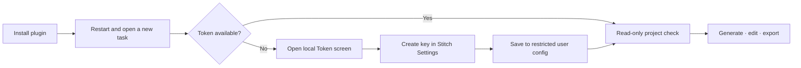

# Stitch Design for Codex


> Design, verify, art-direct, and deliver editable Google Stitch projects from Codex through 43 workflow-oriented Agent Skills and an evidence-driven Harness.

[](https://github.com/partme-ai/codex-stitch-plugin/releases/tag/v0.7.4)
[](#development-and-verification)
[](#what-you-can-build)
[](LICENSE)

[English](README.md) | [简体中文](README.zh-CN.md) · [Install](#installation) · [Quick start](#quick-start) · [Examples](#example-requests) · [Architecture](docs/Stitch-Design-Architecture.md) · [Troubleshooting](#troubleshooting)

## Stitch Design in Codex


The installed plugin exposes three ready-to-run prompts, one bundled Stitch MCP server, 43 workflow Skills, and a secure local Token setup directly in Codex.

## Positioning

`stitch-design` turns product ideas and existing interfaces into editable Google Stitch screens, then carries those artifacts into production frontend workflows. It combines live Stitch generation and editing, design-system operations, code-to-design, local asset import/export, framework conversion, and an evidence-driven Delivery Harness.

| 43 workflow Skills | 17 MCP tools | 15+ frontend targets | 3 verified viewports |
|:---:|:---:|:---:|:---:|
| Design, safety, conversion, delivery | 15 Google Stitch + 2 local asset tools | React, Vue, mobile and more | Desktop, tablet, mobile |

## Installation

### Prerequisites

- Python 3.11 or newer on `PATH`.
- A Google Stitch API key from <https://stitch.withgoogle.com/settings>.
- Optional, for the Harness comparison workflow: `Pillow` from `requirements-harness.txt`.

### From the plugin marketplace

Recommended: track the repository's `main` branch explicitly.

```bash
codex plugin marketplace add partme-ai/codex-stitch-plugin --ref main
codex plugin add stitch-design@partme-ai-stitch
```

Restart Codex or the ChatGPT desktop app, open a new task, and ask Stitch Design to list your projects.

### Other supported Marketplace sources

GitHub shorthand using the repository's default branch:

```bash
codex plugin marketplace add partme-ai/codex-stitch-plugin
codex plugin add stitch-design@partme-ai-stitch
```

Full Git URL pinned to `main`:

```bash
codex plugin marketplace add https://github.com/partme-ai/codex-stitch-plugin.git --ref main
codex plugin add stitch-design@partme-ai-stitch
```

Sparse Git checkout when only Marketplace metadata is needed:

```bash
codex plugin marketplace add https://github.com/partme-ai/codex-stitch-plugin.git \
  --ref main \
  --sparse .agents/plugins
codex plugin add stitch-design@partme-ai-stitch
```

Local checkout for development:

```bash
git clone https://github.com/partme-ai/codex-stitch-plugin.git
codex plugin marketplace add ./codex-stitch-plugin
codex plugin add stitch-design@partme-ai-stitch
```

Confirm or refresh the installation:

```bash
codex plugin marketplace list
codex plugin list
codex plugin marketplace upgrade partme-ai-stitch
```

The Marketplace name is `partme-ai-stitch`; the install selector is `stitch-design@partme-ai-stitch`.

## Quick start

### First run: one local Token screen

The plugin already bundles its MCP connection. The first Stitch request checks credentials and opens the local Token screen only when `STITCH_API_KEY` is missing.



On the first MCP request without a credential, or after a refreshed credential is still rejected with HTTP 401, the plugin automatically opens this local Token screen. A 10-minute cooldown prevents repeated windows while setup is in progress.

1. Create your key in [Stitch Settings](https://stitch.withgoogle.com/settings).
2. Paste it into the masked local field. Never paste it into chat.
3. Return to Codex; start with a read-only request such as “List my Stitch projects.”

Manual fallback if the browser does not open:

```bash
# macOS / Linux
python /path/to/installed/plugin/scripts/stitch_setup.py ui

# Windows
python C:\path\to\installed\plugin\scripts\stitch_setup.py ui
```

The setup page listens only on `127.0.0.1`, loads bundled assets, validates Origin and CSRF, never logs the key, and clears the field after every response. The cooldown marker stores only a launch timestamp. The `python` command on PATH must resolve to Python 3.11 or newer.

## What you can build

| Workflow | Built-in path | Verifiable output |
|:---|:---|:---|
| Create and iterate | Generate, inspect, edit, variants | Bound project and screen identities |
| Govern visual systems | Create, update, list, apply design systems | Design-system identity and version evidence |
| Bring existing UI into Stitch | Upload reviewed HTML/images | Same-project screen resources |
| Export for production | Download HTML, screenshots and referenced assets | Atomic files and SHA-256 manifest |
| Generate frontend code | React, React Native, shadcn/ui, Vue, Vant, Element Plus, Bootstrap, Layui, uView | Editable component source |
| Deliver with gates | Stitch → ImageGen → OCR → roundtrip → comparison → approval | Receipt chain and explicit human approval |

The plugin does not host Stitch or bundle a shared key. Ambiguous writes are reconciled with read operations before any retry.

## Package self-check against OpenAI guidance

| Official requirement | Current repository | Result |
|:---|:---|:---:|
| Stable plugin identity and metadata | `.codex-plugin/plugin.json`, `stitch-design`, publisher and URLs | Pass |
| Skills at the plugin root | `skills/` with 43 validated Skills | Pass |
| Bundled MCP configuration | `.mcp.json` compatibility mapping to the local stdio proxy | Pass for Codex compatibility |
| Visual install metadata | Logo, composer icon, default prompts and README screenshot | Pass |
| Marketplace policy metadata | Installation, `ON_USE` authentication and `Creativity` category | Pass |
| Portable Agent Plugins root manifest | Root `plugin.json` and portable `mcp.json` | Not yet migrated |
| Universal public Plugins Directory | Requires separate OpenAI submission and remote HTTPS MCP review | Not published |

This repository intentionally remains a Codex compatibility package while the portable/public migration gate is open. See [Portable migration gate](docs/portable-migration.md).

## Status and version

| Property | Value |
|:---|:---|
| Plugin ID | `stitch-design` |
| Current candidate | `0.7.4` |
| Current release | [v0.7.4](https://github.com/partme-ai/codex-stitch-plugin/releases/tag/v0.7.4) |
| Previous release | [v0.7.1](https://github.com/partme-ai/codex-stitch-plugin/releases/tag/v0.7.1) |
| Marketplace | `partme-ai-stitch` |
| Authentication | User-owned `STITCH_API_KEY`, requested on first use |
| License | Apache-2.0 |

## Example requests

```text
Read-only: List my Stitch projects and do not create anything.
Generate: Create a responsive product screen in Stitch.
Edit: Preserve the design system and only update the current screen.
Convert: Turn this Stitch screen into production React components.
```

Remote writes require the target project and intended scope. If a write times out, do not immediately repeat it; inspect the project/screen state first.

## MCP tools

The bundled stdio proxy exposes 17 tools: 15 from the Google Stitch MCP server and 2 local asset tools added by this plugin.

### Google Stitch tools (15)

| Tool | Purpose |
|---|---|
| `create_project` | Create a Stitch project |
| `list_projects` | List accessible projects |
| `get_project` | Read one project |
| `delete_project` | Delete a project |
| `generate_screen_from_text` | Generate a screen from a text prompt |
| `list_screens` | List screens in a project |
| `get_screen` | Read one screen |
| `edit_screens` | Edit an existing screen |
| `generate_variants` | Generate design variants |
| `create_design_system` | Create a design system |
| `create_design_system_from_design_md` | Create a design system from a design document |
| `update_design_system` | Update a design system |
| `list_design_systems` | List design systems |
| `apply_design_system` | Apply a design system to a screen |
| `upload_design_md` | Upload a design document |

### Local tools added here (2)

| Tool | Purpose |
|---|---|
| `stitch_local_upload_asset` | Upload a reviewed local image or HTML file into the current project |
| `stitch_local_download_assets` | Download screen HTML, screenshots, and referenced assets with an atomic write and SHA-256 manifest; `referencedAssetPolicy` defaults to `best_effort` and may be set to `strict` |

### Error contract

| Signal | Meaning | Next action |
|---|---|---|
| `ProxyError` | Sanitized proxy failure | Read the message; no automatic retry |
| `UnknownWriteResult` | A write may have reached Stitch without a definitive response | Reconcile with read tools before retrying |
| `ApprovalRequired` | A gate needs an explicit human decision | Approve or reject in the Harness |
| `InvalidTransition` | A state change bypassed an approved gate | Re-run from the previous state |
| `ContractError` | A page specification is unsafe or incomplete | Fix the specification |
| `SecretStoreError` | The credential could not be read or written safely | Re-run the local setup |

Failures are returned as JSON-RPC errors with code `-32000` for a sanitized proxy failure and `-32001` for an unknown write result.

## Configuration

`.mcp.json` starts the bundled proxy from the installed plugin root:

```json
{
  "type": "stdio",
  "command": "python",
  "args": ["scripts/stitch_mcp_proxy.py"],
  "cwd": "."
}
```

Credential precedence:

1. `STITCH_API_KEY` in the current process.
2. The current-user Stitch Design credential file.
3. First-use setup.

Default locations are `$XDG_CONFIG_HOME/stitch-design/credentials.json` (or `~/.config/...`) on Unix and `%APPDATA%\stitch-design\credentials.json` on Windows.

Run a secret-free check:

```bash
python scripts/stitch_setup.py check
```

## Architecture and security

Codex owns plugin loading and approvals. Google Stitch owns remote design data and tool execution. Stitch Design owns workflow instructions, package validation, local credential bootstrap, and error recovery. The authors do not receive MCP traffic.

- [Architecture](docs/Stitch-Design-Architecture.md)
- [Technical solution](docs/Stitch-Design-Technical-Solution.md)
- [Portable migration gate](docs/portable-migration.md)
- [Privacy](PRIVACY.md)
- [Terms](TERMS.md)

### Component responsibilities

| Component | Owns | Does not own |
|---|---|---|
| `scripts/stitch_mcp_proxy.py` | The stdio entry point that starts the proxy | Credential storage |
| `stitch_harness/mcp_proxy.py` | HTTP session handling, tool-list repair, and the write-result rules | Business approval |
| `stitch_harness/secrets.py` | Credential lookup order and the restricted user config | Remote calls |
| `stitch_harness/assets.py` | The two local asset tools | Upstream Stitch behaviour |
| `stitch_harness/orchestrator.py` | The evidence-driven Harness state machine | Remote execution |
| `stitch_harness/storage.py` | Atomic run files and receipt chaining | Rendering |
| `scripts/stitch_setup.py` | The loopback Token screen and the status check | Design work |
| `skills/` (43) | Routing, design, conversion, and delivery instructions | Runtime enforcement |

## Development and verification

```bash
python -m pip install -r requirements-test.txt
python -m unittest discover -s tests -v
python scripts/validate_distribution.py .
python scripts/validate_skills.py skills
python scripts/validate_markdown_links.py .
python scripts/scan_secrets.py .
find scripts skills -type f -name '*.sh' -exec shellcheck {} +
python -m compileall -q scripts stitch_harness skills
git diff --check
```

Version 0.7.4 keeps Stitch's primary HTML, screenshot, and DESIGN.md downloads on the Google/Stitch allowlist, while HTML-referenced dependencies may come from any safe public HTTPS host such as `cdn.tailwindcss.com`. Referenced dependencies now default to `best_effort`: a safe dependency that is temporarily unavailable or has an unsupported response is skipped with a host-only warning while primary artifacts are still published. Set `referencedAssetPolicy: "strict"` to retain all-or-nothing export. Unsafe URLs, HTTP, credential-bearing URLs, localhost, local/internal names, IP literals, redirects, primary-artifact failures, path escapes, byte/file limits, and the independent 500-URL reference discovery budget remain blocked.

Unknown-write reconciliation may bind `target.project_id` and `target.expected_title`. When a complete `list_screens` read succeeds, its evidence binds the project ID, completeness flag and normalized title-hash inventory. Only when the Harness derives that the expected-title hash is absent may `get_screen` be recorded as `skipped` with reason `no_candidate_id`; an applied or discovered candidate still requires a successful `get_screen`. Attempt limits, timestamps, hashes, and duplicate-write protection remain enforced.

Repository preparation for the provider + asset live smoke is complete: the manual-only workflow uses the `STITCH_API_KEY` repository secret, private runner state, sanitized output, and a final `always()` cleanup with read-back absence proof. It has not been run remotely and is not Harness acceptance. The full Harness remains an [interactive local controller path](docs/live-harness-controller.md). See the [live-smoke acceptance register](docs/live-canary-acceptance.md).

## Data and state

| Data | Location | Lifecycle | Secrets |
|---|---|---|---|
| Credential | `$XDG_CONFIG_HOME/stitch-design/credentials.json`, or `%APPDATA%\stitch-design\credentials.json` on Windows | Until you rotate or delete it | Yes: the `STITCH_API_KEY` value |
| Harness run files | `.stitch/` inside your project | Until you archive or delete them | No |
| Receipt chain | Alongside each run | Tamper-evident; grows with each accepted gate | No |
| Downloaded assets | Your chosen output directory | Until you delete them | No |

Run state machine: `DRAFT`, `PREFLIGHT_PASSED`, `STITCH_GENERATED`, `SOURCE_ACCEPTED`, `ART_GENERATED`, `ART_ACCEPTED`, `ROUNDTRIPPED`, `EDITABILITY_VERIFIED`, `COMPARISON_ACCEPTED`, `AWAITING_USER_APPROVAL`, `APPROVED`, `ARCHIVED`, `RECONCILING`, `BLOCKED`.

## Troubleshooting

| Symptom | Action |
|:---|:---|
| Stitch tools are missing | Confirm plugin status, restart Codex, open a new task |
| Credentials are missing | Open `stitch_setup.py ui` |
| Authentication fails | Replace the key, restart, run read-only `list_projects` |
| A write times out | Read project/screen state; do not blindly resubmit |
| ChatGPT web stalls | Treat the path as experimental; use local Codex |

## Upgrade

```bash
codex plugin marketplace upgrade partme-ai-stitch
codex plugin add stitch-design@partme-ai-stitch
```

## Contributing and support

Open functional issues at <https://github.com/partme-ai/codex-stitch-plugin/issues>. Before proposing a change, state the Stitch API surface you verified against, whether it alters the tool catalogue or the write-result rules, and include the affected validators.

## Source and license

The 39 upstream Skill snapshots are based on `full-stack-skills/stitch-skills` commit `62ef81825ad6ddc85bb6b8426e65b1a9d07d109b`; `stitch-local-setup`, `stitch-delivery-harness`, `stitch-delete-project`, and `stitch-design-use` are plugin-specific. Official adapted material traces to `google-labs-code/stitch-skills` commit `0337446dadde6f8c94210444e2aa9d546126480f`.

See [LICENSE](LICENSE), [NOTICE](NOTICE), and [THIRD_PARTY_NOTICES.md](THIRD_PARTY_NOTICES.md).
