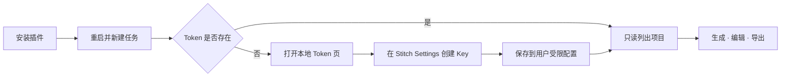

# Stitch Design for Codex


> 通过 43 个面向工作流的 Agent Skills 和证据驱动 Harness，在 Codex 中设计、验证、美术增强并交付可编辑的 Google Stitch 项目。

[](https://github.com/partme-ai/partme-stitch-plugin/releases/tag/v0.7.8)
[](#开发与验证)
[](#可完成的工作)
[](LICENSE)

[English](README.md) | [简体中文](README.zh-CN.md) · [安装](#安装) · [快速开始](#快速开始) · [使用示例](#使用示例) · [架构文档](docs/Stitch-Design-Architecture.zh_CN.md) · [故障排查](#故障排查)

## Codex 中的 Stitch Design


安装后，Codex 会直接展示三个可运行提示、一个内置 Stitch MCP 服务器、43 个工作流 Skills 和安全的本地 Token 设置。

## 项目定位

`stitch-design` 把产品想法和现有界面转化为可编辑的 Google Stitch 屏幕，并继续交付到生产前端工作流。它组合了 Stitch 实时生成与编辑、设计系统操作、code-to-design、本地资产导入导出、框架转换和证据驱动 Delivery Harness。

| 43 个工作流 Skills | 17 个 MCP 工具 | 15+ 前端目标 | 3 种验证视口 |
|:---:|:---:|:---:|:---:|
| 设计、安全、转换、交付 | 15 个 Google Stitch + 2 个本地资产工具 | React、Vue、移动端等 | Desktop、Tablet、Mobile |

## 安装

### 前置条件

- `PATH` 上有 Python 3.11 或更新版本。
- 来自 <https://stitch.withgoogle.com/settings> 的 Google Stitch API Key。
- 仅 Harness 比对工作流需要（可选）：`requirements-harness.txt` 中的 `Pillow`。

### 从插件市场安装

推荐显式跟踪本仓库 `main` 分支：

```bash
codex plugin marketplace add partme-ai/partme-stitch-plugin --ref main
codex plugin add stitch-design@partme-ai-stitch
```

安装后重启 Codex 或 ChatGPT 桌面应用，新建任务，并让 Stitch Design 列出你的项目。

### 其他官方支持的 Marketplace 来源

使用 GitHub shorthand 和仓库默认分支：

```bash
codex plugin marketplace add partme-ai/partme-stitch-plugin
codex plugin add stitch-design@partme-ai-stitch
```

使用完整 Git URL 并固定 `main`：

```bash
codex plugin marketplace add https://github.com/partme-ai/partme-stitch-plugin.git --ref main
codex plugin add stitch-design@partme-ai-stitch
```

仅稀疏检出 Marketplace 元数据：

```bash
codex plugin marketplace add https://github.com/partme-ai/partme-stitch-plugin.git \
  --ref main \
  --sparse .agents/plugins
codex plugin add stitch-design@partme-ai-stitch
```

本地克隆，适用于开发与调试：

```bash
git clone https://github.com/partme-ai/partme-stitch-plugin.git
codex plugin marketplace add ./partme-stitch-plugin
codex plugin add stitch-design@partme-ai-stitch
```

检查或刷新安装：

```bash
codex plugin marketplace list
codex plugin list
codex plugin marketplace upgrade partme-ai-stitch
```

Marketplace 名称是 `partme-ai-stitch`，插件安装选择器是 `stitch-design@partme-ai-stitch`。

## 快速开始

### 第一次使用：一张本地 Token 页面

插件已经内置 MCP 连接。第一次 Stitch 请求会检查凭据，仅在缺少 `STITCH_API_KEY` 时打开本地 Token 页面。



首次发起 MCP 请求且凭据缺失，或刷新凭据后仍收到 HTTP 401 时，插件会自动打开这个本地 Token 页面。设置期间启用 10 分钟冷却，避免重复请求不断弹窗。

1. 在 [Stitch Settings](https://stitch.withgoogle.com/settings) 创建 Key。
2. 粘贴到本地密码输入框，不要发送到聊天。
3. 回到 Codex，先执行“列出我的 Stitch 项目”这类只读请求。

浏览器没有自动打开时的手动降级方式：

```bash
# macOS / Linux
python /已安装插件路径/scripts/stitch_setup.py ui

# Windows
python C:\已安装插件路径\scripts\stitch_setup.py ui
```

设置页仅监听 `127.0.0.1`，只加载内置资产，校验 Origin 与 CSRF，不记录 Key，每次响应后清空输入框；冷却标记只保存启动时间。PATH 中的 `python` 命令必须解析为 Python 3.11 或更高版本。

## 可完成的工作

| 工作流 | 内置路径 | 可验证输出 |
|:---|:---|:---|
| 创建与迭代 | 生成、检查、编辑、变体 | 绑定的项目与屏幕身份 |
| 管理视觉系统 | 创建、更新、列出、应用设计系统 | 设计系统身份与版本证据 |
| 把现有 UI 带入 Stitch | 上传已审核 HTML/图片 | 同项目屏幕资源 |
| 生产导出 | 下载 HTML、截图和引用资产 | 原子文件与 SHA-256 清单 |
| 生成前端代码 | React、React Native、shadcn/ui、Vue、Vant、Element Plus、Bootstrap、Layui、uView | 可编辑组件源码 |
| 门禁化交付 | Stitch → 明确美术决策 → 可选 ImageGen 闭环或仅验证 Stitch → 批准 | Receipt 链与明确人工决策 |

插件不托管 Stitch，不内置共享 Key。写操作结果不明时，必须先读取远端状态再决定是否重试。

## 对照 OpenAI 官方规范的包自检

| 官方要求 | 当前仓库 | 结果 |
|:---|:---|:---:|
| 稳定插件身份与元数据 | `.codex-plugin/plugin.json`、`stitch-design`、开发者与 URL | 通过 |
| 根目录 Skills | `skills/` 中 43 个已验证 Skills | 通过 |
| 内置 MCP 配置 | `.mcp.json` 兼容映射到本地 stdio 代理 | Codex 兼容模式通过 |
| 安装面视觉元数据 | Logo、composer icon、默认提示与 README 截图 | 通过 |
| Marketplace 策略元数据 | 安装策略、`ON_USE` 认证和 `Creativity` 分类 | 通过 |
| Portable Agent Plugins 根清单 | 根 `plugin.json` 与 portable `mcp.json` | 尚未迁移 |
| Universal 公共 Plugins Directory | 需要独立 OpenAI 提交和远端 HTTPS MCP 审查 | 未发布 |

当前仓库在 portable/public 迁移门禁关闭前，保持 Codex compatibility package。详见 [Portable 迁移门禁](docs/portable-migration.md)。

## 状态与版本

| 属性 | 值 |
|:---|:---|
| 插件 ID | `stitch-design` |
| 当前候选版本 | `0.7.8` |
| 当前版本 | [v0.7.8](https://github.com/partme-ai/partme-stitch-plugin/releases/tag/v0.7.8) |
| 上一版本 | [v0.7.1](https://github.com/partme-ai/partme-stitch-plugin/releases/tag/v0.7.1) |
| Marketplace | `partme-ai-stitch` |
| 认证 | 用户自有 `STITCH_API_KEY`，首次使用时配置 |
| 许可证 | Apache-2.0 |

## 使用示例

```text
只读：列出我的 Stitch 项目，不要创建任何内容。
生成：在 Stitch 中创建响应式产品页面。
编辑：保留设计系统，只修改当前屏幕。
转换：把这个 Stitch 屏幕转换为生产级 React 组件。
```

远程写操作需要明确目标项目与范围。写操作超时后不要立即重发，应先检查项目或屏幕状态。

## MCP 工具

内置的 stdio 代理共暴露 17 个工具：15 个来自 Google Stitch MCP 服务器，另有 2 个由本插件添加的本地资产工具。

### Google Stitch 工具（15 个）

| 工具 | 用途 |
|---|---|
| `create_project` | 创建 Stitch 工程 |
| `list_projects` | 列出可访问工程 |
| `get_project` | 读取单个工程 |
| `delete_project` | 删除工程 |
| `generate_screen_from_text` | 按文本提示生成页面 |
| `list_screens` | 列出工程内页面 |
| `get_screen` | 读取单个页面 |
| `edit_screens` | 编辑已有页面 |
| `generate_variants` | 生成设计变体 |
| `create_design_system` | 创建设计系统 |
| `create_design_system_from_design_md` | 依据设计文档创建设计系统 |
| `update_design_system` | 更新设计系统 |
| `list_design_systems` | 列出设计系统 |
| `apply_design_system` | 将设计系统应用到页面 |
| `upload_design_md` | 上传设计文档 |

### 本插件添加的本地工具（2 个）

| 工具 | 用途 |
|---|---|
| `stitch_local_upload_asset` | 把已审核的本地图片或 HTML 上传到当前工程 |
| `stitch_local_download_assets` | 下载页面 HTML、截图与引用资产，原子写入并生成 SHA-256 清单；`referencedAssetPolicy` 默认 `best_effort`，也可设为 `strict` |

### 错误契约

| 信号 | 含义 | 下一步 |
|---|---|---|
| `ProxyError` | 已脱敏的代理失败 | 阅读消息；不自动重试 |
| `UnknownWriteResult` | 写入可能已到达 Stitch 但没有确定响应 | 先用读工具核对，再考虑重试 |
| `ApprovalRequired` | 某个门禁需要人工明确决策 | 在 Harness 中批准或拒绝 |
| `InvalidTransition` | 状态变更绕过了已批准的门禁 | 从上一步重新执行 |
| `ContractError` | 页面规格不安全或不完整 | 修正规格 |
| `SecretStoreError` | 凭据无法被安全读写 | 重新运行本地设置 |

失败以 JSON-RPC 错误返回：已脱敏的代理失败用 `-32000`，未知写入结果用 `-32001`。

## 配置

`.mcp.json` 从安装后的插件根目录启动内置 stdio 代理。凭据优先级为：

1. 当前进程中的 `STITCH_API_KEY`。
2. 当前用户的 Stitch Design 凭据文件。
3. 首次设置页面。

Unix 默认位置是 `$XDG_CONFIG_HOME/stitch-design/credentials.json`（未设置时为 `~/.config/...`），Windows 为 `%APPDATA%\stitch-design\credentials.json`。

只检查状态、不回显 Key：

```bash
python scripts/stitch_setup.py check
```

## 架构与安全

Codex 负责插件加载和审批；Google Stitch 负责远程设计数据和工具执行；Stitch Design 负责工作流指令、包验证、本地凭据引导与失败恢复。插件作者不接收 MCP 流量。

- [架构文档](docs/Stitch-Design-Architecture.zh_CN.md)
- [技术方案](docs/Stitch-Design-Technical-Solution.zh_CN.md)
- [Portable 迁移门禁](docs/portable-migration.md)
- [隐私说明](PRIVACY.md)
- [使用条款](TERMS.md)

### 组件职责

| 组件 | 负责 | 不负责 |
|---|---|---|
| `scripts/stitch_mcp_proxy.py` | 启动代理的 stdio 入口 | 凭据存储 |
| `stitch_harness/mcp_proxy.py` | HTTP 会话处理、工具清单修补与写入结果规则 | 业务批准 |
| `stitch_harness/secrets.py` | 凭据查找顺序与受限的用户配置 | 远端调用 |
| `stitch_harness/assets.py` | 两个本地资产工具 | 上游 Stitch 行为 |
| `stitch_harness/orchestrator.py` | 证据驱动的 Harness 状态机 | 远端执行 |
| `stitch_harness/storage.py` | 原子运行文件与回执链 | 渲染 |
| `scripts/stitch_setup.py` | 回环 Token 页面与状态检查 | 设计工作 |
| `skills/`（43 个） | 路由、设计、转换与交付指令 | 运行时强制 |

## 开发与验证

```bash
python -m pip install -r requirements-test.txt
python -m unittest discover -s tests -v
python scripts/validate_distribution.py .
python scripts/validate_skills.py skills
python scripts/validate_markdown_links.py .
python scripts/scan_secrets.py .
find scripts skills -type f -name '*.sh' -exec shellcheck {} +
python -m compileall -q scripts stitch_harness skills
git diff --check
```

0.7.8 继续要求 Stitch 主 HTML、截图和 DESIGN.md 来自 Google/Stitch 白名单，但允许 HTML 引用的依赖来自任意安全的公网 HTTPS 主机，例如 `cdn.tailwindcss.com`。引用依赖现在默认使用 `best_effort`：安全依赖临时不可用或返回不支持的响应时，跳过该依赖、返回仅含主机名的 warning，并继续原子发布主产物；设置 `referencedAssetPolicy: "strict"` 可恢复全有或全无。非安全 URL、HTTP、带账号密码的 URL、localhost、本地/内部域名、IP 字面量、重定向、主产物失败、路径逃逸、字节/文件上限和独立的500条引用URL发现预算仍会被阻止。

未知写入证据可以绑定 `target.project_id` 与 `target.expected_title`。完整 `list_screens` 证据必须绑定项目ID、完整性标记和规范化标题哈希清单；只有Harness自行计算出预期标题哈希不在清单中时，才允许把 `get_screen` 记录为 `skipped/no_candidate_id`。一旦发现候选，仍必须成功调用 `get_screen` 才能判定已应用。三轮上限、时间戳、哈希和防重复写保护保持不变。

Provider + asset 真实 smoke 已在本机通过：运行使用本机受限配置中的 Key、私有状态与脱敏输出，并在最后执行一次 `always()` 清理后再只读确认不存在。手动 workflow 仍只从 `STITCH_API_KEY` Repository Secret 取值；本机 smoke 不是 Harness 验收，完整 Harness 走[本地交互式控制器](docs/live-harness-controller.zh_CN.md)。详见 [真实 smoke 验收台账](docs/live-canary-acceptance.zh_CN.md)。

## 数据与状态

| 数据 | 位置 | 生命周期 | 是否含秘密 |
|---|---|---|---|
| 凭据 | `$XDG_CONFIG_HOME/stitch-design/credentials.json`，Windows 为 `%APPDATA%\stitch-design\credentials.json` | 直到你轮换或删除 | 是：`STITCH_API_KEY` 的值 |
| Harness 运行文件 | 工程内的 `.stitch/` | 直到你归档或删除 | 否 |
| 回执链 | 与每次运行同目录 | 防篡改；随每个通过的门禁增长 | 否 |
| 已下载资产 | 你选择的输出目录 | 直到你删除 | 否 |

运行状态机：`DRAFT`、`PREFLIGHT_PASSED`、`STITCH_GENERATED`、`SOURCE_ACCEPTED`、`AWAITING_ART_DECISION`、`ART_ENHANCEMENT_APPROVED`、`STITCH_ONLY_SELECTED`、`ART_GENERATED`、`ART_ACCEPTED`、`SEMANTIC_NORMALIZED`、`ROUNDTRIPPED`、`EDITABILITY_VERIFIED`、`COMPARISON_ACCEPTED`、`AWAITING_USER_APPROVAL`、`APPROVED`、`ARCHIVED`、`CANCELLED`、`RECONCILING`、`BLOCKED`。

接受 Stitch 原稿不等于授权 ImageGen。Harness 必须暂停并要求用户严格回复 `enhance`、`keep_stitch` 或 `cancel`；只有原样的 `enhance` 回复才能进入二次图片生成路径。“确认”“继续”“做按”等模糊回复不得映射，CLI 也不再提供可自称用户来源的 `--source user` 参数。

规格可选择严格的 `provider_generated` 来源或 `imported_editable_html`。导入 HTML 仍必须绑定与画布完全一致的真实渲染图并通过完整 DOM/文案门禁；OCR 一旦报告文字漂移即失败，增强交付在上传和读回 Stitch 前还会记录确定性语义规范化 receipt。

视觉比较使用与画布相关的粗粒度边缘几何来计算布局分数；插画纹理、阴影、颜色和组件精度由独立的五维质量评审判断，不再把预期的美术增强误判为布局漂移。

## 故障排查

| 现象 | 处理 |
|:---|:---|
| 找不到 Stitch 工具 | 检查插件状态，重启 Codex，新建任务 |
| 缺少凭据 | 打开 `stitch_setup.py ui` |
| 认证失败 | 更换 Key，重启并只读调用 `list_projects` |
| 写操作超时 | 读取项目/屏幕状态，不盲目重发 |
| ChatGPT 网页停滞 | 保持实验性，使用本地 Codex |

## 升级

```bash
codex plugin marketplace upgrade partme-ai-stitch
codex plugin add stitch-design@partme-ai-stitch
```

## 贡献与支持

功能问题请提交到 <https://github.com/partme-ai/partme-stitch-plugin/issues>。提交变更前，请说明你验证所用的 Stitch 接口范围、是否改动工具清单或写入结果规则，并附上受影响的校验器。

## 来源与许可

全部 43 个 Skill 本体从 [full-stack-skills/stitch-skills](https://github.com/full-stack-skills/stitch-skills)（单一事实源）逐字 vendor，由 `skills.lock.json` 钉住来源仓库、ref、commit 与逐技能摘要。刷新请运行 `python3 scripts/vendor/skill_vendor.py update`；切勿直接编辑 `skills/`。官方适配内容可追溯到 `google-labs-code/stitch-skills` 提交 `0337446dadde6f8c94210444e2aa9d546126480f`。

详见 [LICENSE](LICENSE)、[NOTICE](NOTICE) 和 [THIRD_PARTY_NOTICES.md](THIRD_PARTY_NOTICES.md)。
