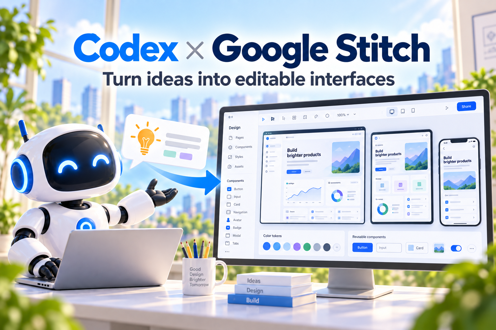
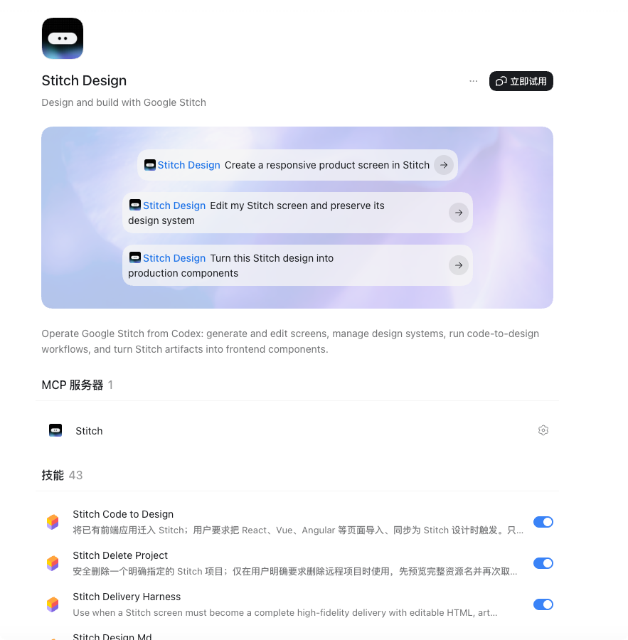
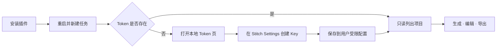

# Stitch Design for Codex



> 通过 43 个面向工作流的 Agent Skills 和证据驱动 Harness，在 Codex 中设计、验证、美术增强并交付可编辑的 Google Stitch 项目。

[](https://github.com/partme-ai/codex-stitch-plugin/releases/tag/v0.6.0)
[](#开发与验证)
[](#可完成的工作)
[](LICENSE)

[English](README.md) | [简体中文](README.zh-CN.md) · [快速安装](#两条命令完成安装) · [使用示例](#使用示例) · [架构文档](docs/Stitch-Design-Architecture.zh_CN.md) · [故障排查](#故障排查)

## Codex 中的 Stitch Design



安装后，Codex 会直接展示三个可运行提示、一个内置 Stitch MCP 服务器、43 个工作流 Skills 和安全的本地 Token 设置。

## 项目定位

`stitch-design` 把产品想法和现有界面转化为可编辑的 Google Stitch 屏幕，并继续交付到生产前端工作流。它组合了 Stitch 实时生成与编辑、设计系统操作、code-to-design、本地资产导入导出、框架转换和证据驱动 Delivery Harness。

| 43 个工作流 Skills | 17 个 MCP 工具 | 15+ 前端目标 | 3 种验证视口 |
|:---:|:---:|:---:|:---:|
| 设计、安全、转换、交付 | 15 个 Google Stitch + 2 个本地资产工具 | React、Vue、移动端等 | Desktop、Tablet、Mobile |

## 两条命令完成安装

推荐显式跟踪本仓库 `main` 分支：

```bash
codex plugin marketplace add partme-ai/codex-stitch-plugin --ref main
codex plugin add stitch-design@partme-ai-stitch
```

安装后重启 Codex 或 ChatGPT 桌面应用，新建任务，并让 Stitch Design 列出你的项目。

### 其他官方支持的 Marketplace 来源

使用 GitHub shorthand 和仓库默认分支：

```bash
codex plugin marketplace add partme-ai/codex-stitch-plugin
codex plugin add stitch-design@partme-ai-stitch
```

使用完整 Git URL 并固定 `main`：

```bash
codex plugin marketplace add https://github.com/partme-ai/codex-stitch-plugin.git --ref main
codex plugin add stitch-design@partme-ai-stitch
```

仅稀疏检出 Marketplace 元数据：

```bash
codex plugin marketplace add https://github.com/partme-ai/codex-stitch-plugin.git \
  --ref main \
  --sparse .agents/plugins
codex plugin add stitch-design@partme-ai-stitch
```

本地克隆，适用于开发与调试：

```bash
git clone https://github.com/partme-ai/codex-stitch-plugin.git
codex plugin marketplace add ./codex-stitch-plugin
codex plugin add stitch-design@partme-ai-stitch
```

检查或刷新安装：

```bash
codex plugin marketplace list
codex plugin list
codex plugin marketplace upgrade partme-ai-stitch
```

Marketplace 名称是 `partme-ai-stitch`，插件安装选择器是 `stitch-design@partme-ai-stitch`。

## 第一次使用：一张本地 Token 页面

插件已经内置 MCP 连接。第一次 Stitch 请求会检查凭据，仅在缺少 `STITCH_API_KEY` 时打开本地 Token 页面。



1. 在 [Stitch Settings](https://stitch.withgoogle.com/settings) 创建 Key。
2. 粘贴到本地密码输入框，不要发送到聊天。
3. 回到 Codex，先执行“列出我的 Stitch 项目”这类只读请求。

手动打开设置页：

```bash
# macOS / Linux
python /已安装插件路径/scripts/stitch_setup.py ui

# Windows
python C:\已安装插件路径\scripts\stitch_setup.py ui
```

设置页仅监听 `127.0.0.1`，只加载内置资产，校验 Origin 与 CSRF，不记录 Key，每次响应后清空输入框。PATH 中的 `python` 命令必须解析为 Python 3.11 或更高版本。

## 可完成的工作

| 工作流 | 内置路径 | 可验证输出 |
|:---|:---|:---|
| 创建与迭代 | 生成、检查、编辑、变体 | 绑定的项目与屏幕身份 |
| 管理视觉系统 | 创建、更新、列出、应用设计系统 | 设计系统身份与版本证据 |
| 把现有 UI 带入 Stitch | 上传已审核 HTML/图片 | 同项目屏幕资源 |
| 生产导出 | 下载 HTML、截图和引用资产 | 原子文件与 SHA-256 清单 |
| 生成前端代码 | React、React Native、shadcn/ui、Vue、Vant、Element Plus、Bootstrap、Layui、uView | 可编辑组件源码 |
| 门禁化交付 | Stitch → ImageGen → OCR → 回灌 → 对比 → 批准 | Receipt 链与明确人工批准 |

插件不托管 Stitch，不内置共享 Key。写操作结果不明时，必须先读取远端状态再决定是否重试。

## 对照 OpenAI 官方规范的包自检

| 官方要求 | 当前仓库 | 结果 |
|:---|:---|:---:|
| 稳定插件身份与元数据 | `.codex-plugin/plugin.json`、`stitch-design`、开发者与 URL | 通过 |
| 根目录 Skills | `skills/` 中 43 个已验证 Skills | 通过 |
| 内置 MCP 配置 | `.mcp.json` 兼容映射到本地 stdio 代理 | Codex 兼容模式通过 |
| 安装面视觉元数据 | Logo、composer icon、默认提示与 README 截图 | 通过 |
| Marketplace 策略元数据 | 安装策略、`ON_USE` 认证和 `Creativity` 分类 | 通过 |
| Portable Agent Plugins 根清单 | 根 `plugin.json` 与 portable `mcp.json` | 尚未迁移 |
| Universal 公共 Plugins Directory | 需要独立 OpenAI 提交和远端 HTTPS MCP 审查 | 未发布 |

当前仓库在 portable/public 迁移门禁关闭前，保持 Codex compatibility package。详见 [Portable 迁移门禁](docs/portable-migration.md)。

## 项目状态

| 属性 | 值 |
|:---|:---|
| 插件 ID | `stitch-design` |
| 当前版本 | [v0.6.0](https://github.com/partme-ai/codex-stitch-plugin/releases/tag/v0.6.0) |
| 上一版本 | [v0.5.4](https://github.com/partme-ai/codex-stitch-plugin/releases/tag/v0.5.4) |
| Marketplace | `partme-ai-stitch` |
| 认证 | 用户自有 `STITCH_API_KEY`，首次使用时配置 |
| 许可证 | Apache-2.0 |

## 使用示例

```text
只读：列出我的 Stitch 项目，不要创建任何内容。
生成：在 Stitch 中创建响应式产品页面。
编辑：保留设计系统，只修改当前屏幕。
转换：把这个 Stitch 屏幕转换为生产级 React 组件。
```

远程写操作需要明确目标项目与范围。写操作超时后不要立即重发，应先检查项目或屏幕状态。

## 配置

`.mcp.json` 从安装后的插件根目录启动内置 stdio 代理。凭据优先级为：

1. 当前进程中的 `STITCH_API_KEY`。
2. 当前用户的 Stitch Design 凭据文件。
3. 首次设置页面。

Unix 默认位置是 `$XDG_CONFIG_HOME/stitch-design/credentials.json`（未设置时为 `~/.config/...`），Windows 为 `%APPDATA%\stitch-design\credentials.json`。

只检查状态、不回显 Key：

```bash
python scripts/stitch_setup.py check
```

## 架构与安全

Codex 负责插件加载和审批；Google Stitch 负责远程设计数据和工具执行；Stitch Design 负责工作流指令、包验证、本地凭据引导与失败恢复。插件作者不接收 MCP 流量。

- [架构文档](docs/Stitch-Design-Architecture.zh_CN.md)
- [技术方案](docs/Stitch-Design-Technical-Solution.zh_CN.md)
- [Portable 迁移门禁](docs/portable-migration.md)
- [隐私说明](PRIVACY.md)
- [使用条款](TERMS.md)

## 开发与验证

```bash
python -m pip install -r requirements-test.txt
python -m unittest discover -s tests -v
python scripts/validate_distribution.py .
python scripts/validate_skills.py skills
python scripts/validate_markdown_links.py .
python scripts/scan_secrets.py .
find scripts skills -type f -name '*.sh' -exec shellcheck {} +
python -m compileall -q scripts stitch_harness skills
git diff --check
```

0.6.0 包含 43 个 Skills、两个带命名空间的本地资产工具、类型化 Harness evidence writer、隔离图片比较、显式对账/恢复状态和可恢复归档发布。Provider + asset canary 已通过并验证清理；Delivery Harness 在发布前已取得用户明确批准并完成归档。

Provider + asset 真实 smoke 已在本机通过：运行使用本机受限配置中的 Key、私有状态与脱敏输出，并在最后执行单次删除后只读确认不存在。手动 workflow 仍只从 `STITCH_API_KEY` Repository Secret 取值；本机 smoke 不是 Harness 验收，完整 Harness 走[本地交互式控制器](docs/live-harness-controller.zh_CN.md)。详见 [真实 smoke 验收台账](docs/live-canary-acceptance.zh_CN.md)。

## 故障排查

| 现象 | 处理 |
|:---|:---|
| 找不到 Stitch 工具 | 检查插件状态，重启 Codex，新建任务 |
| 缺少凭据 | 打开 `stitch_setup.py ui` |
| 认证失败 | 更换 Key，重启并只读调用 `list_projects` |
| 写操作超时 | 读取项目/屏幕状态，不盲目重发 |
| ChatGPT 网页停滞 | 保持实验性，使用本地 Codex |

## 升级

```bash
codex plugin marketplace upgrade partme-ai-stitch
codex plugin add stitch-design@partme-ai-stitch
```

## 来源与许可

39 个上游 Skill 快照基于 `full-stack-skills/stitch-skills` 提交 `62ef81825ad6ddc85bb6b8426e65b1a9d07d109b`；`stitch-local-setup`、`stitch-delivery-harness`、`stitch-delete-project` 和 `stitch-design-use` 为插件本地 Skill。官方适配内容可追溯到 `google-labs-code/stitch-skills` 提交 `0337446dadde6f8c94210444e2aa9d546126480f`。

详见 [LICENSE](LICENSE)、[NOTICE](NOTICE) 和 [THIRD_PARTY_NOTICES.md](THIRD_PARTY_NOTICES.md)。
