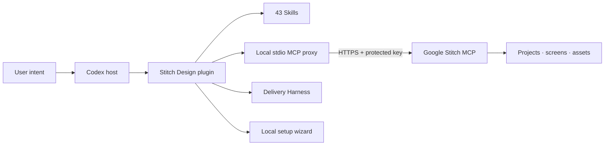
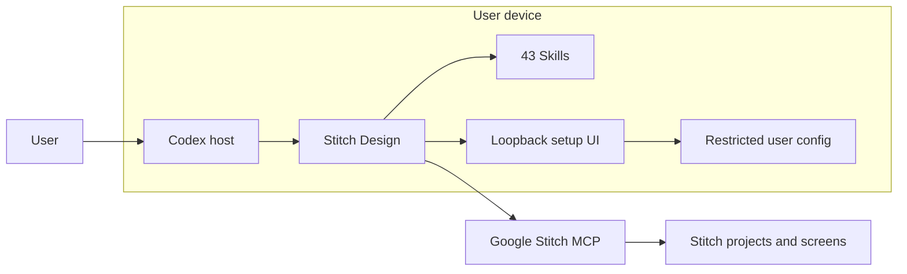
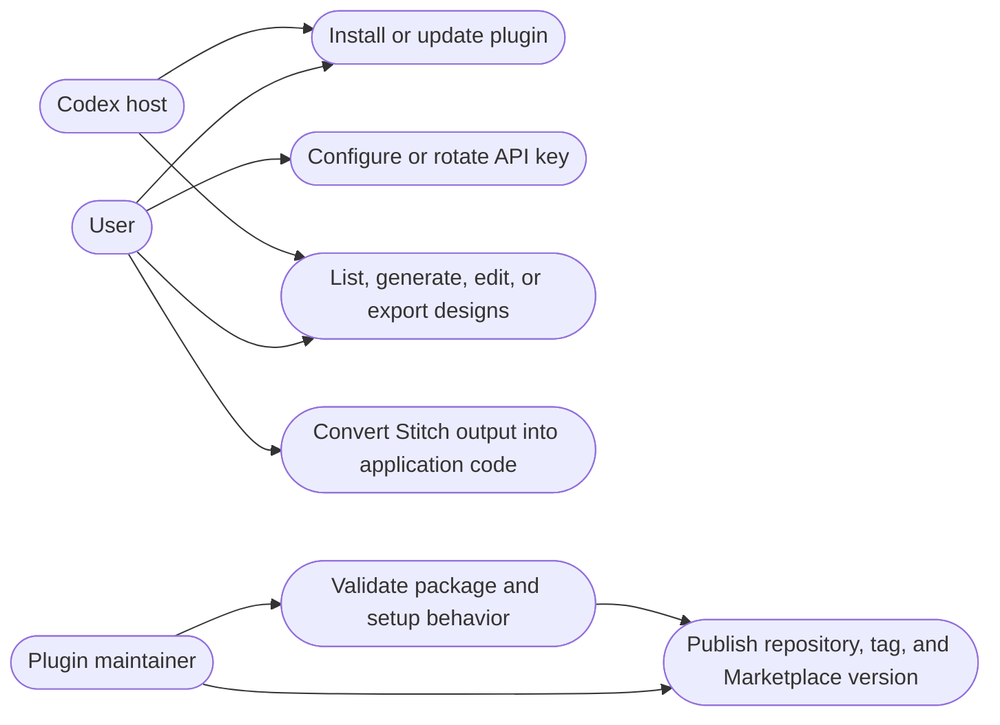
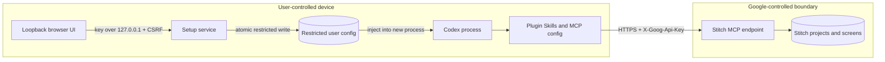
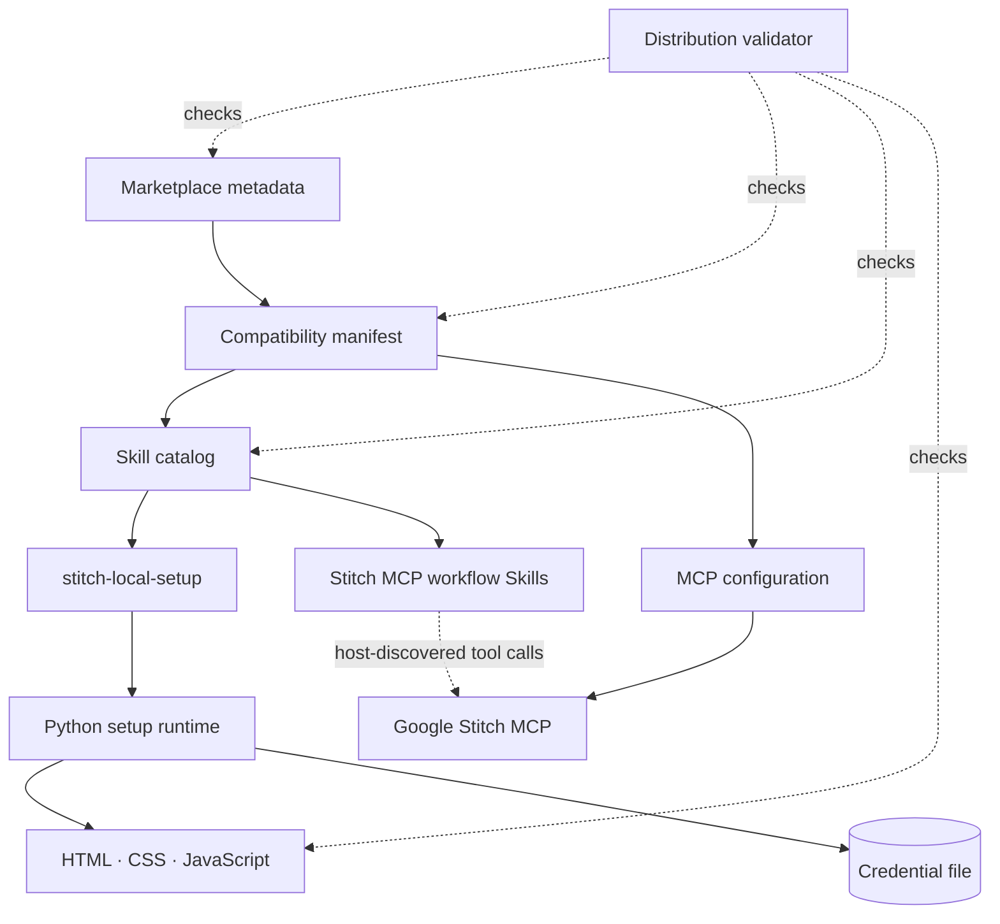
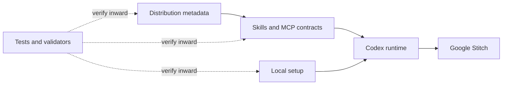
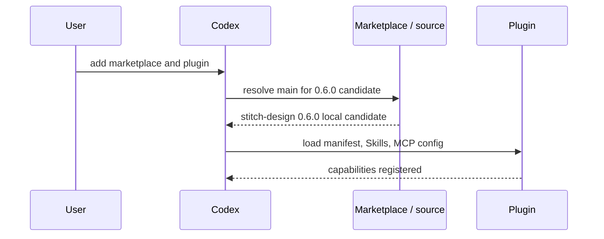
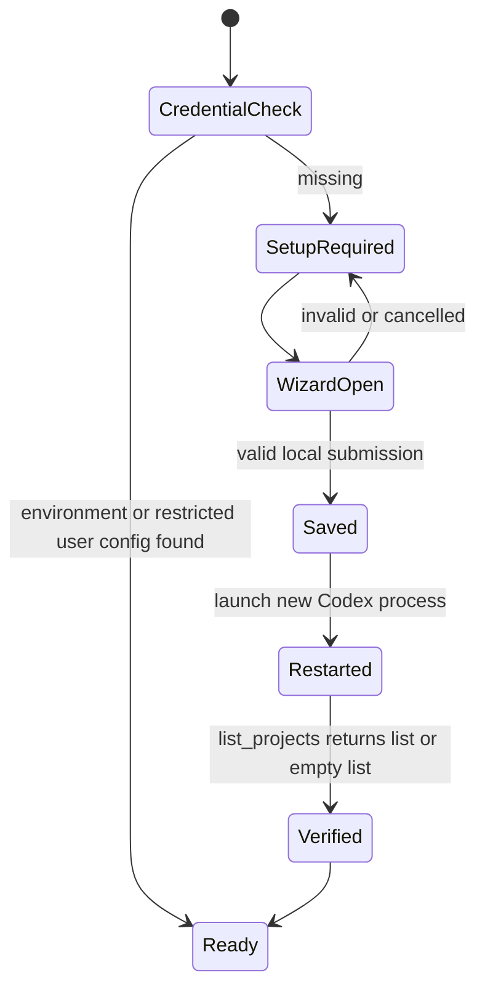
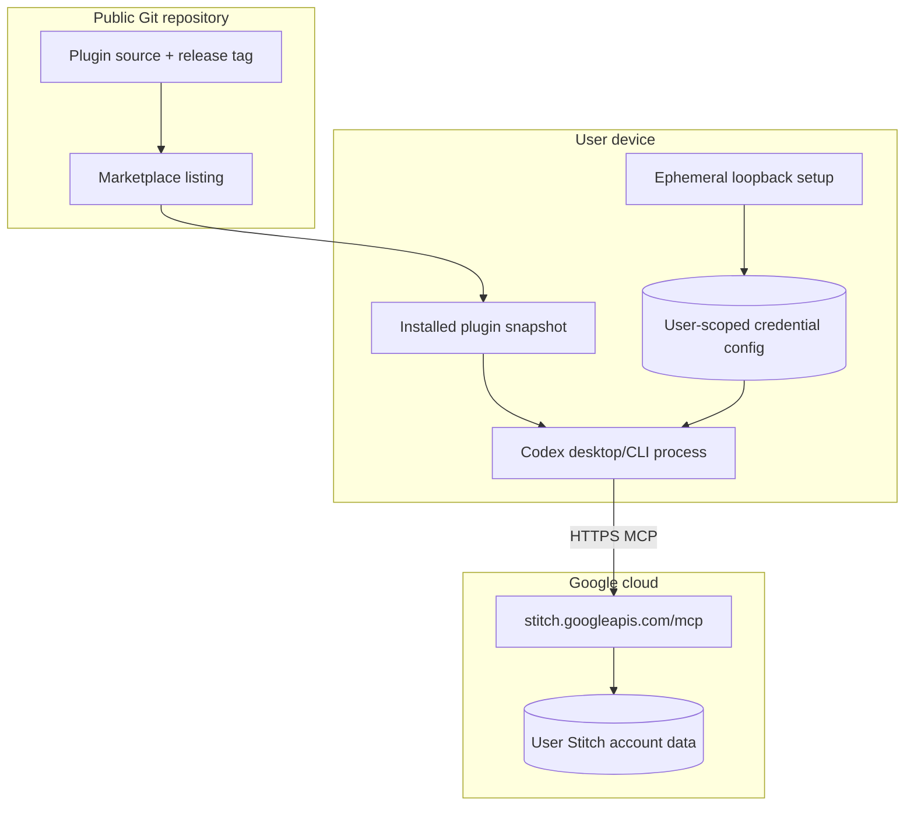

# Stitch Design Architecture

> **Purpose:** Define the verified architecture, trust boundaries, lifecycle, failure semantics, and evolution constraints of Stitch Design.
>
> **Version:** 0.6.0 · **Status:** Local release candidate · **Evidence date:** 2026-09-14

[简体中文](Stitch-Design-Architecture.zh_CN.md) | [Technical solution](Stitch-Design-Technical-Solution.md) | [README](../README.md)

## 1. Executive summary

Stitch Design is a Codex compatibility plugin that packages 43 Agent Skills, a secret-safe local stdio proxy to Google Stitch MCP, a first-use credential wizard, and an evidence-driven delivery Harness. Codex owns tool invocation; Google Stitch owns project and screen data; the plugin owns secure connection, workflow state, validation, receipts, and local archival.



## 2. Drivers, scope, and non-goals

| Driver | Architecture response | Evidence |
|:---|:---|:---|
| Installable Codex extension | Compatibility manifest plus repository marketplace | `.codex-plugin/plugin.json`, `.agents/plugins/marketplace.json` |
| Repeatable design workflows | One discoverable `SKILL.md` per workflow | `skills/`, distribution validator |
| User-owned Stitch identity | `STITCH_API_KEY` mapped at runtime, never committed | `.mcp.json`, `PRIVACY.md` |
| Low-friction first use | Local three-step setup page | `scripts/stitch_setup.py`, `assets/setup/` |
| Safe failure | Read probes before retrying ambiguous writes | Skill workflows and tests |

Non-goals: hosting Google Stitch, providing a shared author key, implementing OAuth, persisting Stitch project data, or claiming ChatGPT web support before end-to-end authentication succeeds.

## 3. Context and trust boundary

### 3.1 System context



### 3.2 Use cases



### 3.3 Trust and data flow



The API key is stored in a restricted current-user configuration file. The local stdio proxy reads it once per process and sends it only to the exact Google Stitch HTTPS origin. Only HTTP 401 refreshes and retries once; HTTP 403 is permission denied and is not refreshed or replayed. Plugin authors do not receive MCP traffic.

## 4. Components and dependency direction

### 4.1 Logical containers



| Component | Responsibility | Does not own |
|:---|:---|:---|
| Marketplace | Repository discovery and install policy | Runtime authentication |
| Compatibility manifest | Identity, version, UI metadata, component paths | Tool implementation |
| Skill catalog | Routing, workflows, safety, recovery, code conversion | Host lifecycle |
| MCP configuration | Start the bundled stdio proxy from the plugin root | Secret persistence |
| Delivery Harness | Page contracts, states, gates, receipts, approval and archive | Provider-side generation |
| Setup service | Local UI, atomic credential save, child-process injection | Global system environment |
| Distribution validator | Manifest, assets, Skill count, secret-like patterns | Live Stitch availability |
| Google Stitch MCP | Tool schema and design operations | Plugin packaging |

The compatibility manifest remains Python-only. On every supported host, PATH `python` must resolve to Python 3.11 or newer before Codex loads the MCP server.

Dependency direction is manifest → Skills/MCP/setup assets. Skills may call discovered tools but must not embed provider credentials or private project identifiers.



## 5. Runtime flows

### 5.1 Installation and discovery



### 5.2 First use



The setup server binds to `127.0.0.1` on a random port, uses a per-run CSRF token, rejects wrong origins and oversized bodies, sets no-store/security headers, and shuts down after ten minutes or interruption.

### 5.3 Tool invocation and recovery

Read operations may be retried after a clear transient failure. Non-idempotent generation/edit/upload operations are not blindly retried after timeout; Skills first query project or screen state. Unknown remote state remains unknown.

```mermaid
sequenceDiagram
    participant U as User
    participant C as Codex
    participant S as Workflow Skill
    participant M as Stitch MCP
    U->>C: request a Stitch operation
    C->>S: select workflow and validate scope
    S->>M: invoke tool with runtime key
    alt confirmed success
      M-->>S: project/screen/artifact result
      S-->>C: verified result
    else authentication failure
      M-->>S: unauthorized
      S-->>C: run setup or rotate key
    else write timeout or unknown receipt
      S->>M: read-only project/screen probe
      alt result found
        M-->>S: created or updated resource
        S-->>C: recovered verified result
      else result not found
        S-->>C: unknown state; no blind retry
      end
    end
```

## 6. Data and configuration

| Data | Authority | Location | Lifecycle |
|:---|:---|:---|:---|
| Plugin metadata | Repository | Manifest/marketplace | Release controlled |
| API key | User | Environment or restricted user config | Until replaced/removed |
| Harness receipts | Local run | Business project `.stitch/runs` | Until project cleanup |
| Design data | Google Stitch | Remote account | Google/user policy |
| Setup CSRF token | Setup process | Memory only | One process |
| Tests and examples | Repository | `tests/`, Skill resources | Version controlled |

Configuration precedence: explicit process `STITCH_API_KEY` → restricted user configuration → setup required.

## 7. Security and privacy

- No real credentials in manifests, source, examples, URLs, logs, or release notes.
- The wizard uses a password input and clears it after each response.
- The loopback server loads no external scripts, fonts, images, or analytics.
- Unix configuration directories use `0700` and files `0600`; Windows inherits the current user's profile ACL.
- The user configuration is permission-restricted but is not an encrypted system secret vault.
- Remote write operations require the user's requested scope and normal host approval behavior.

## 8. Reliability and operations

| Failure | Detection | Response |
|:---|:---|:---|
| Plugin not discovered | Missing Skills/tools | Reinstall, restart, new task |
| Credential absent | Boolean preflight | Open local wizard |
| Credential invalid | Stitch authentication response | Replace key, do not print it |
| Setup server rejected request | Generic local error | Keep input local and retry |
| Write timeout | No confirmed receipt | Read probe; do not resubmit blindly |
| ChatGPT web connection stalls | No terminal tool result | Keep path experimental |

The plugin has no long-running production service, database, queue, metrics backend, or backup responsibility. Operational evidence consists of host status, local validation, test results, remote release state, and read-only Stitch probes.

## 9. Compatibility, deployment, and evolution

### 9.1 Deployment topology



### 9.2 Publication flow


Version 0.4.0 is verified with the Codex compatibility layout. Root portable manifests remain intentionally inactive because Agent Plugins 1.0 does not provide a portable API-key reference for HTTP headers. The migration gate is documented in [portable-migration.md](portable-migration.md).

ADR summary:

| ADR | Decision | Reversal condition |
|:---|:---|:---|
| 001 | Keep compatibility layout | Portable credential reference or verified OAuth |
| 002 | Map user key through environment header | Official Stitch connector becomes available |
| 003 | Use Python stdlib loopback wizard | Host provides secure first-use secret UI |
| 004 | Keep ChatGPT web experimental | `list_projects` passes end to end |

## 10. Verification evidence

Release `v0.4.0` at commit `6cf533ee884157a5a265c6200bbff6842b62c0f5` passed 16 automated tests, validation of 40 Skills, Skill structure validation, ShellCheck, secret-pattern scanning, and visual checks at 390×884, 768×1024, and 1280×1024. These gates prove package and setup behavior; they do not prove continuous Google Stitch availability.

---

**Document version:** 2.5.0 · **Status:** Aligned with local 0.6.0 candidate · **Updated:** 2026-09-14
