# Stitch Design 架构文档

> **文档目的**：定义 Stitch Design 已验证的架构、信任边界、生命周期、失败语义与演进约束。
>
> **适用版本**：0.7.2 · **状态**：发布候选 · **事实核验日期**：2026-09-14

[English](Stitch-Design-Architecture.md) | [技术方案](Stitch-Design-Technical-Solution.zh_CN.md) | [README 中文](../README.zh-CN.md)

## 1. 执行摘要

Stitch Design 是 Codex compatibility plugin，包含 43 个 Agent Skills、连接 Google Stitch MCP 的本地安全 stdio 代理、首次设置向导和证据驱动的交付 Harness。Codex 负责工具调用，Google Stitch 负责项目和屏幕数据，插件负责安全连接、工作流状态、门禁、receipts 和本地归档。

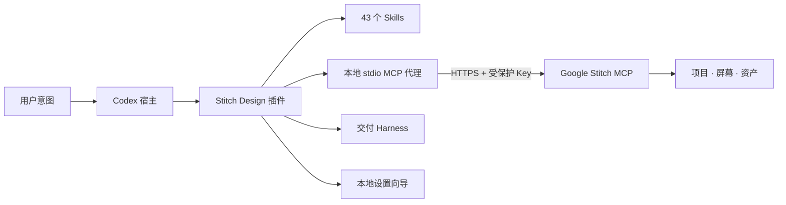

## 2. 架构驱动、范围与非目标

| 驱动 | 架构响应 | 证据 |
|:---|:---|:---|
| 可安装的 Codex 扩展 | Compatibility manifest 与仓库 Marketplace | `.codex-plugin/plugin.json`、`.agents/plugins/marketplace.json` |
| 可复用设计工作流 | 每个工作流一个可发现的 `SKILL.md` | `skills/`、分发校验器 |
| 用户自有 Stitch 身份 | 运行时映射 `STITCH_API_KEY`，不提交凭据 | `.mcp.json`、`PRIVACY.md` |
| 简单首次使用 | 本地单卡片 Token 页面 | `scripts/stitch_setup.py`、`assets/setup/` |
| 安全失败 | 非幂等写入结果不明时先读后判 | Skill 工作流与测试 |

非目标：托管 Google Stitch、提供作者共享 Key、实现 OAuth、保存 Stitch 业务数据，或在端到端认证通过前宣称 ChatGPT 网页版可用。

## 3. 上下文与信任边界

### 3.1 系统上下文

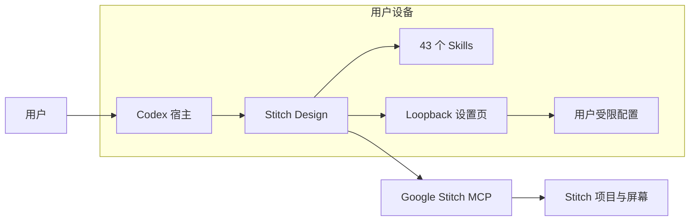

### 3.2 用例图

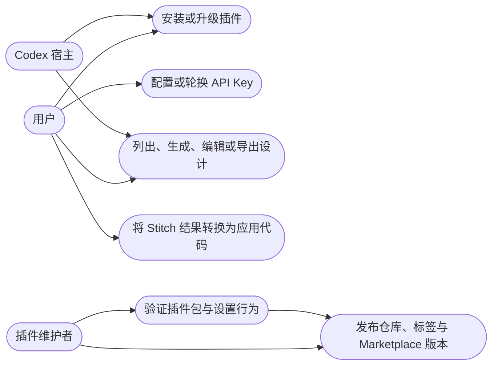

### 3.3 信任边界与数据流

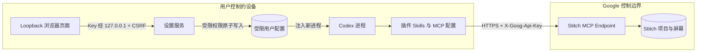

API Key 保存到当前用户的受限配置文件。本地 stdio 代理每个进程读取一次，并只发送到 Google Stitch 的精确 HTTPS 源。仅 HTTP 401 刷新并重试一次；HTTP 403 表示权限不足，不刷新也不重放。插件作者不接收 MCP 流量。

## 4. 组件与依赖方向

### 4.1 逻辑容器图

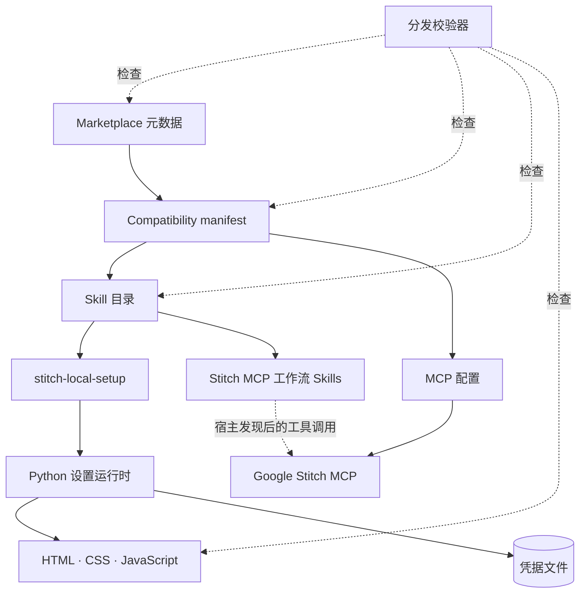

| 组件 | 负责 | 不负责 |
|:---|:---|:---|
| Marketplace | 仓库发现和安装策略 | 运行时认证 |
| Compatibility manifest | 身份、版本、界面元数据、组件路径 | 工具实现 |
| Skill 目录 | 路由、工作流、安全、恢复、代码转换 | 宿主生命周期 |
| MCP 配置 | 从插件根目录启动内置 stdio 代理 | 凭据持久化 |
| 交付 Harness | 页面契约、状态、门禁、receipts、批准与归档 | 供应商生成能力 |
| 设置服务 | 本地页面、原子保存、子进程注入 | 系统全局环境 |
| 分发校验器 | 清单、资产、Skill 数量和秘密模式 | Stitch 实时可用性 |
| Google Stitch MCP | 工具 Schema 与设计操作 | 插件打包 |

Compatibility manifest 保持纯 Python 架构。Codex 加载 MCP Server 前，所有支持宿主的 PATH 的 `python` 必须解析为 Python 3.11 或更高版本。

依赖方向为 manifest → Skills/MCP/设置资产。Skill 可以调用实际发现的工具，但不得内置供应商凭据或私人项目 ID。

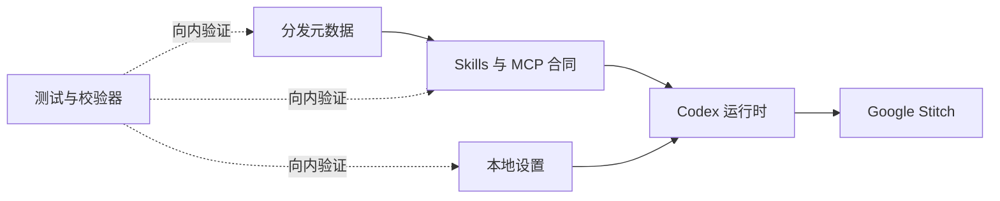

## 5. 运行主链

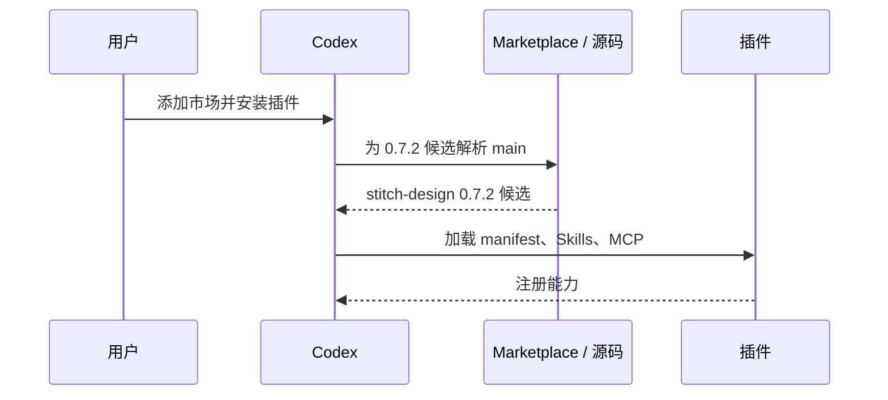

首次使用状态：

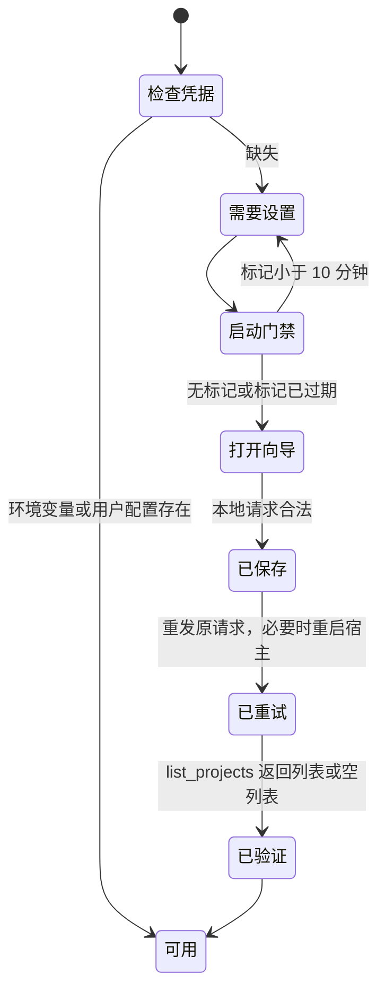

设置服务只监听 `127.0.0.1` 随机端口，使用单次 CSRF Token，拒绝错误 Origin 和超限请求，设置 no-store 安全 Header，并在十分钟后或中断时停止。

读操作在明确瞬态失败后可以重试。生成、编辑和上传等非幂等写操作超时后不得盲目重发，必须先查询项目或屏幕状态。

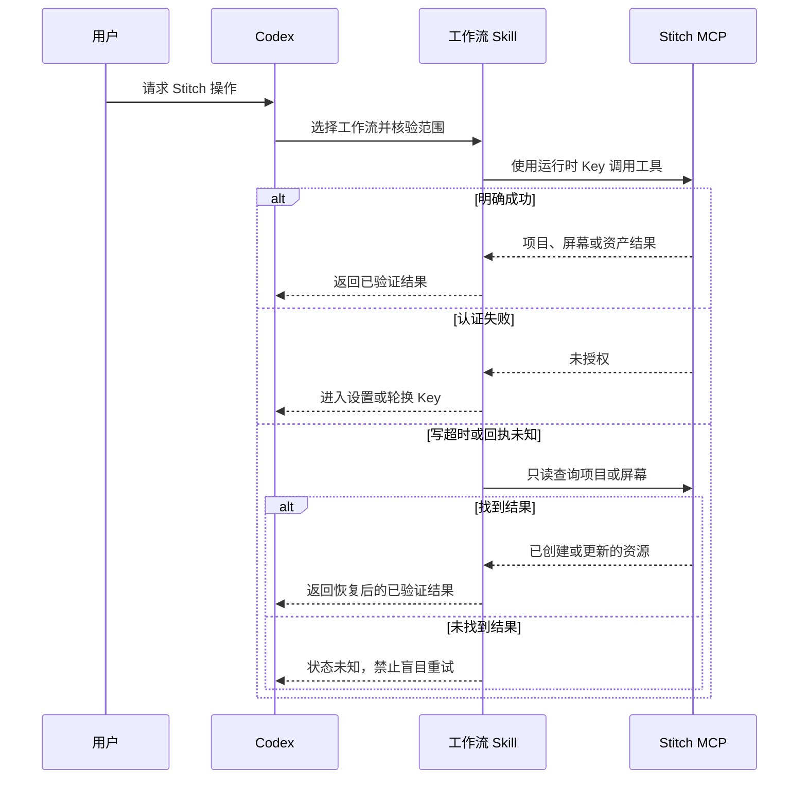

## 6. 数据、配置与秘密

| 数据 | 权威来源 | 位置 | 生命周期 |
|:---|:---|:---|:---|
| 插件元数据 | Git 仓库 | manifest/marketplace | 随版本 |
| API Key | 用户 | 环境变量或受限用户配置 | 直到替换/清除 |
| Harness receipts | 本地运行 | 业务项目 `.stitch/runs` | 直到项目清理 |
| 设计数据 | Google Stitch | 远程账号 | Google/用户策略 |
| CSRF Token | 设置进程 | 仅内存 | 单进程 |
| 测试与示例 | Git 仓库 | `tests/`、Skill 资源 | 随版本 |

配置优先级：显式进程 `STITCH_API_KEY` → 受限用户配置 → 进入首次设置。

## 7. 安全与隐私

- 清单、源码、示例、URL、日志和 Release 不包含真实凭据。
- 页面使用密码输入框，每次响应后清空。
- Loopback 页面不加载外部脚本、字体、图片和分析服务。
- Unix 目录为 `0700`、文件为 `0600`；Windows 继承当前用户目录 ACL。
- 用户配置依赖文件权限保护，本身不提供内容加密。
- 远程写操作只在用户请求范围和宿主审批规则内执行。

## 8. 可靠性与运维

| 故障 | 检测 | 处理 |
|:---|:---|:---|
| 插件未发现 | 缺少 Skills/工具 | 重装、重启、新任务 |
| 凭据缺失 | 布尔预检 | 打开本地向导 |
| 凭据无效 | Stitch 认证响应 | 更换 Key，不回显 |
| 设置请求被拒绝 | 本地通用错误 | 留在页面重试 |
| 写操作超时 | 无确认回执 | 读探针，禁止盲重试 |
| 网页连接停滞 | 无终态结果 | 保持实验性 |

本插件没有常驻生产服务、数据库、队列、指标平台或备份职责。运维证据来自宿主状态、本地校验、测试、远端 Release 和只读 Stitch 探针。

## 9. 兼容、部署与演进

### 9.1 部署拓扑图

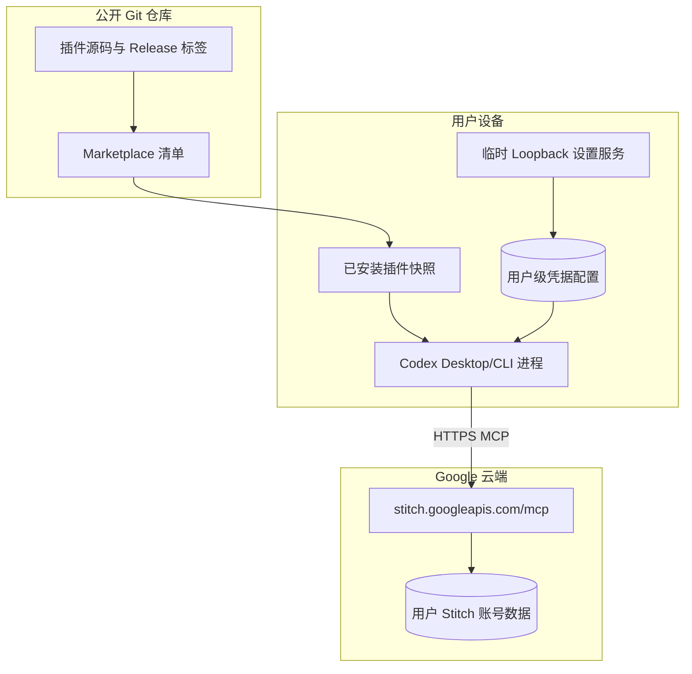

### 9.2 发布流程图

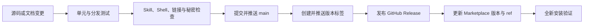

0.4.0 已验证 Codex compatibility layout。由于 Agent Plugins 1.0 没有 HTTP Header API Key 的可移植秘密引用，根级 portable manifests 保持禁用；门禁见 [portable-migration.md](portable-migration.md)。

| ADR | 决策 | 反转条件 |
|:---|:---|:---|
| 001 | 保留 compatibility layout | 有可移植凭据引用或 OAuth |
| 002 | 通过环境 Header 映射用户 Key | 官方 Stitch connector 可用 |
| 003 | Python 标准库实现 Loopback 向导 | 宿主提供安全首次认证 UI |
| 004 | ChatGPT 网页版保持实验性 | `list_projects` 端到端通过 |

## 10. 验证证据

`v0.4.0` 对应提交 `6cf533ee884157a5a265c6200bbff6842b62c0f5`：16 项自动化测试、40 个 Skills 分发校验、Skill 结构校验、ShellCheck、秘密模式扫描，以及 390×884、768×1024、1280×1024 三档视觉检查均通过。这些证据证明包和设置流程，不代表 Google Stitch 持续可用。

### 10.1 受控 provider + asset smoke 边界

手动 live-canary workflow 验证 MCP 生命周期/目录以及 provider、本地资产操作，并分离公开证据与清理私有状态：POSIX 使用 `0600`，Windows 依赖当前用户 runner temp/profile ACL。创建响应在身份落盘前中断时，清理使用私有唯一标题做有界只读对账，只有一个精确匹配才执行一次删除；删除结果不明后仍做有界不存在性探针。变体门禁要求同项目内唯一且不同于源屏幕的身份。该 workflow 不是 Delivery Harness 验收，也不生成用户批准 receipt；真实 Harness 走独立的[交互式控制器](live-harness-controller.zh_CN.md)。

---

**文档版本**：2.7.2 · **状态**：已对齐 0.7.2 发布候选 · **最后更新**：2026-09-14
