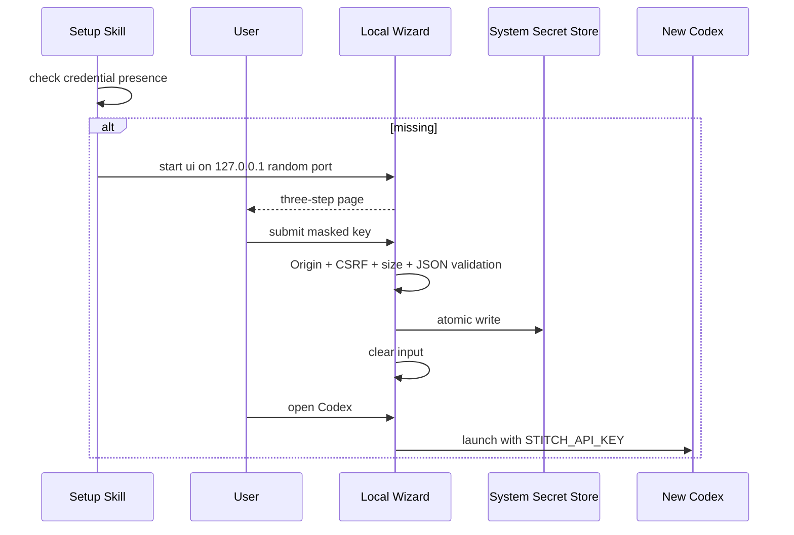
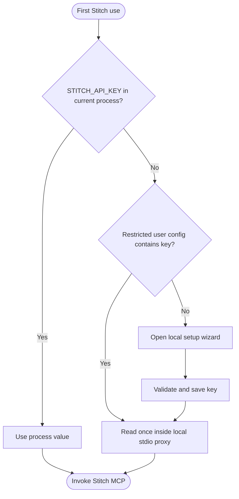
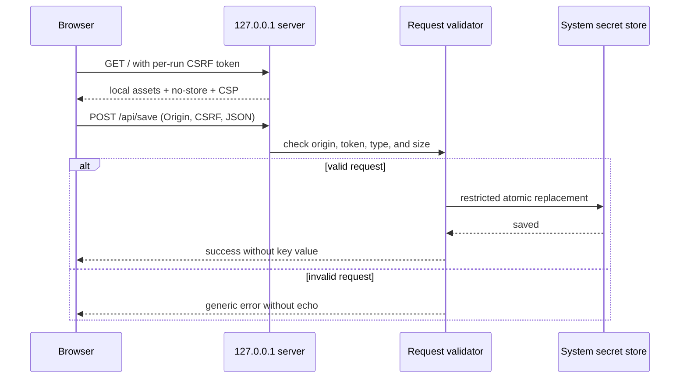
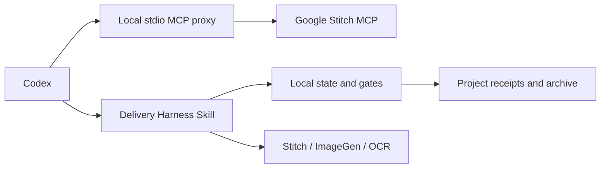
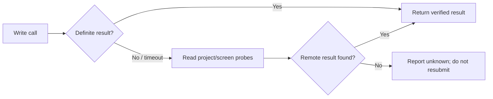
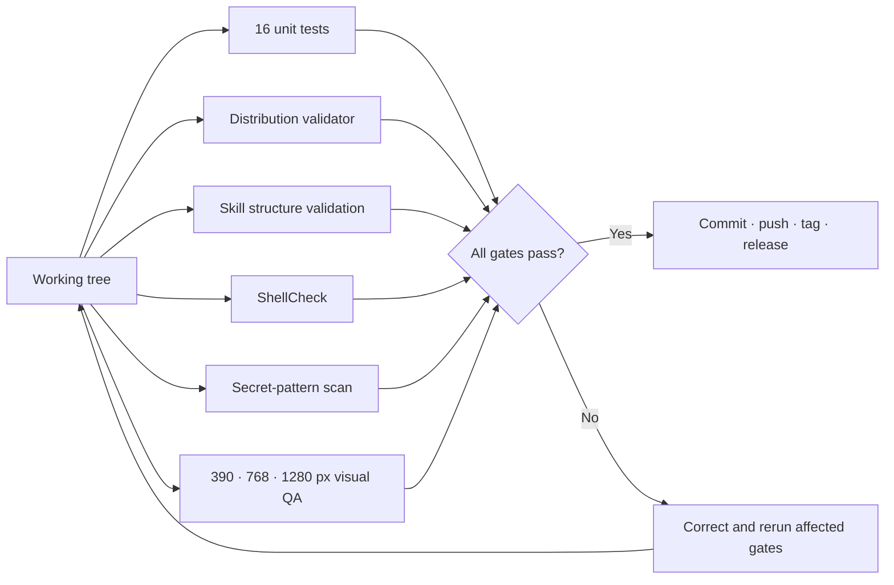

# Stitch Design Technical Solution

> **Scope:** Implementation decisions, interfaces, security controls, tests, release, and migration for Stitch Design 0.5.1.
>
> **Updated:** 2026-09-13

[简体中文](Stitch-Design-Technical-Solution.zh_CN.md) | [Architecture](Stitch-Design-Architecture.md)

## 1. Solution baseline

| Area | Selected solution | Reason |
|:---|:---|:---|
| Host packaging | Codex compatibility manifest | Currently supported and verified |
| Tool transport | Bundled stdio proxy to Google Stitch HTTP MCP | Reliable host integration and provider-owned execution |
| Authentication | Process environment or restricted user configuration | Avoids interactive system prompts and keeps the key outside the package |
| Workflow layer | 41 Agent Skills plus Delivery Harness | Precise discovery and verified delivery |
| First-use UI | Python stdlib loopback server + static assets | No new runtime dependency |
| Credential persistence | Cross-platform current-user JSON with restricted permissions | Predictable non-interactive behavior |
| Validation | Python unittest + distribution validator + ShellCheck | Reproducible offline gates |

## 2. Repository mapping

| Path | Contract |
|:---|:---|
| `.codex-plugin/plugin.json` | Plugin identity, version, presentation, MCP path |
| `.agents/plugins/marketplace.json` | Public Git source and `ON_USE` policy |
| `.mcp.json` | Bundled stdio proxy command and plugin-root working directory |
| `stitch_harness/` | Contracts, proxy, gates, receipts, state and archive |
| `skills/` | Workflow and conversion contracts |
| `scripts/stitch_setup.py` | Setup, check, run, CLI, desktop, UI server |
| `assets/setup/` | Single-card onboarding page |
| `scripts/validate_distribution.py` | Package contract and secret-like pattern scan |
| `tests/` | Distribution, credential, HTTP security, and UI structure tests |

## 3. First-use implementation



HTTP routes:

| Route | Method | Purpose | Guard |
|:---|:---:|:---|:---|
| `/` | GET | HTML shell | no-store + CSP |
| `/styles.css` | GET | Local styles | same origin |
| `/app.js` | GET | Local interaction | same origin |
| `/api/save` | POST | Validate and persist key | Origin, CSRF, JSON, 8192-byte cap |
| `/api/launch` | POST | Launch Codex child process | Origin and CSRF |

The server overrides request logging and never returns submitted values. The UI does not use cookies, localStorage, sessionStorage, remote assets, or telemetry.

## 4. Credential configuration



The wizard writes to the restricted current-user configuration. Native system stores are accessed only by an explicit advanced migration command; successful migration is verified before the source is atomically scrubbed.

Key rotation: open the UI, save the new key, start a new Codex process, run read-only `list_projects`, then revoke the old key in Stitch Settings.

### 4.1 Loopback request flow



## 5. MCP, Harness, and Skill behavior

The local stdio proxy owns MCP initialization, session headers, JSON/SSE responses, one authentication refresh, and secret redaction. The Delivery Harness owns page contracts, finite states, deterministic gates, receipt hashes, recovery, explicit approval, and archive publication. Agent Skills invoke the real Stitch, ImageGen, OCR, and visual tools and import normalized evidence; provider success text alone is never accepted.



The plugin does not reimplement Stitch SDK methods. It delegates live project, screen, design-system, generation, editing, variant, upload, and artifact behavior to the discovered Stitch MCP tools. Skills own task routing, local preparation, parameter checks, scope control, and ambiguous-write recovery.

Write recovery rule:



## 6. Security controls

| Threat | Control | Evidence |
|:---|:---|:---|
| Key committed to package | Environment mapping and secret scan | Validator |
| Cross-site local POST | Exact Origin and CSRF validation | HTTP tests |
| Oversized/malformed request | JSON content type and 8192-byte limit | Handler/tests |
| Browser persistence | No storage APIs; clear input | `app.js` |
| External content execution | Self-only CSP and bundled assets | Response headers |
| Duplicate remote writes | Read-before-retry workflow | Skill contracts |
| Shared identity | User-provided key only | Privacy and setup docs |

## 7. Verification and release



```bash
python3 -m unittest discover -s tests -v
python3 scripts/validate_distribution.py .
python3.13 /Users/wandl/.codex/skills/.system/skill-creator/scripts/quick_validate.py skills/stitch-local-setup
shellcheck scripts/stitch_setup.sh
git diff --check
```

Release proof for 0.4.0:

- commit/tag/remote SHA: `6cf533ee884157a5a265c6200bbff6842b62c0f5`;
- 16 automated tests passed;
- 40 Skills validated;
- public Marketplace install resolved version 0.4.0;
- installed artifact matched source except local `.DS_Store`;
- onboarding rendered at 390×884, 768×1024, and 1280×1024.

## 8. Limitations and roadmap

| Item | Current status | Exit condition |
|:---|:---|:---|
| ChatGPT web | Experimental | Verified connector/OAuth and `list_projects` |
| Portable Agent Plugins manifest | Blocked | Portable credential reference or OAuth |
| Encrypted local vault | Not implemented | Host-managed secret UI/store |
| Windows live acceptance | Code path only | Real Windows host validation |
| Continuous remote CI | No workflow present | Add and verify GitHub Actions |

---

**Document version:** 2.1.0 · **Status:** Aligned with the 0.5.1 release candidate
