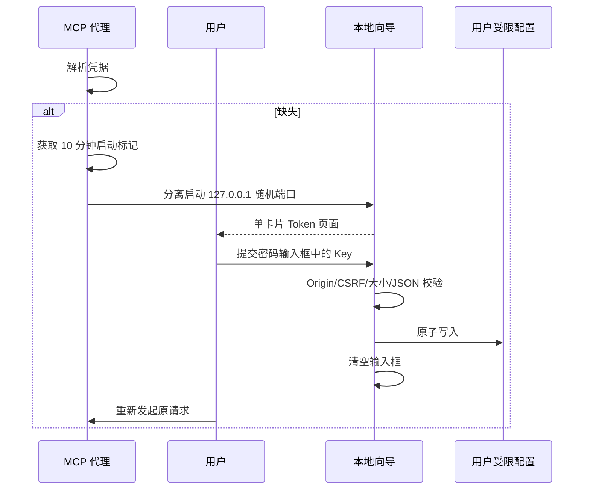
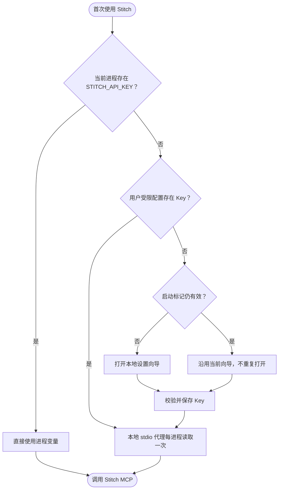
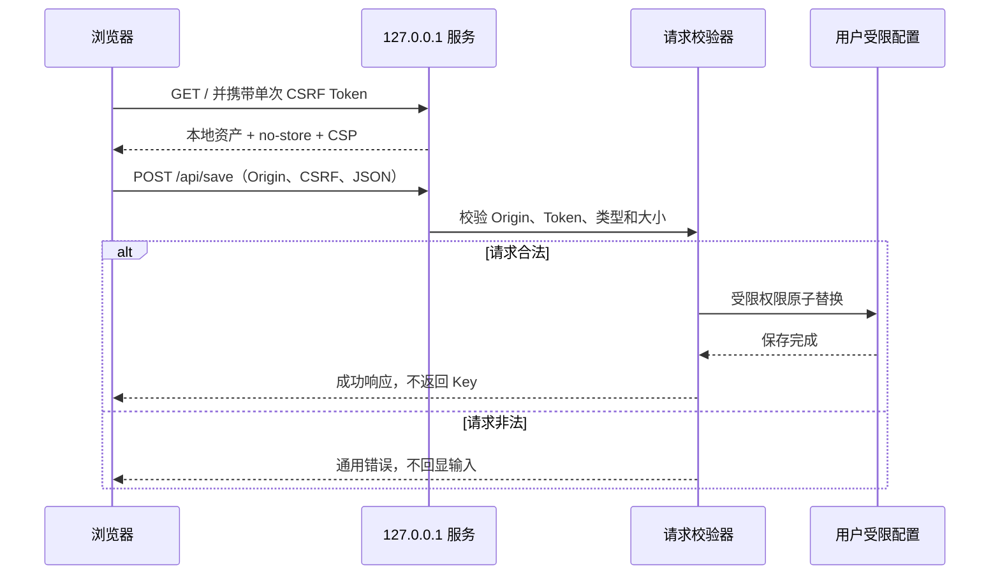
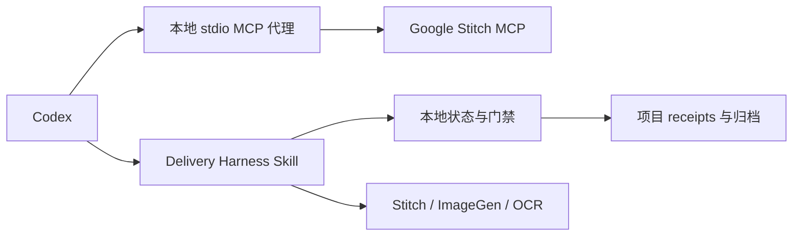
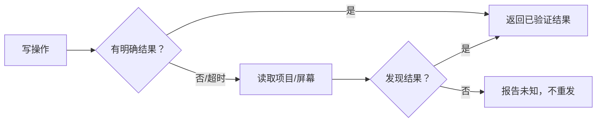
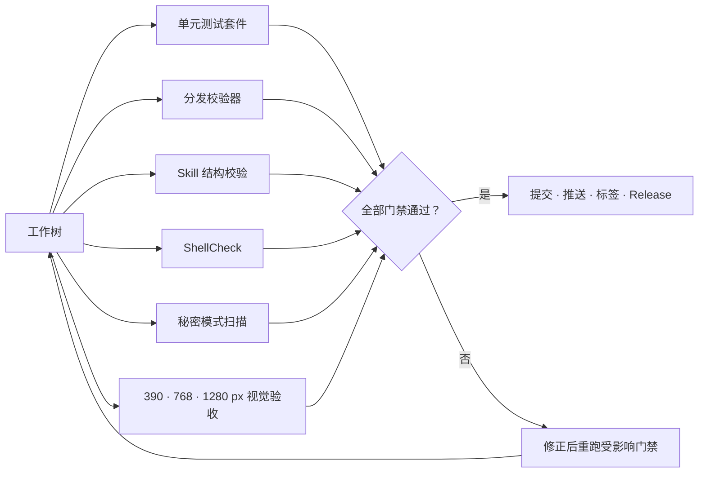

# Stitch Design 技术方案

> **范围**：说明 Stitch Design 0.7.7 的实现决策、接口、安全、测试、发布和迁移方案。
>
> **最后更新**：2026-09-14

[English](Stitch-Design-Technical-Solution.md) | [架构文档](Stitch-Design-Architecture.zh_CN.md)

## 1. 技术基线

| 领域 | 选型 | 理由 |
|:---|:---|:---|
| 宿主打包 | Codex compatibility manifest | 当前已支持并验证 |
| 工具传输 | 内置 stdio 代理连接 Google Stitch HTTP MCP | 宿主连接可靠，工具执行仍由供应商负责 |
| 认证 | 显式进程环境或受限用户配置 | 避免交互式系统弹窗，Key 不进入插件包 |
| 工作流 | 43 个 Agent Skills + 交付 Harness | 精确发现与可验证交付 |
| 首次设置 | Python 标准库 Loopback 服务 + 静态页面 | 不增加第三方运行依赖 |
| 凭据保存 | 跨平台当前用户 JSON，使用受限权限 | 行为可预测且非交互 |
| 验证 | unittest、分发校验、ShellCheck | 可复现离线门禁 |

## 2. 技术决策记录

| 决策 | 理由 | 反转条件 |
|:---|:---|:---|
| 以兼容包形态发布，并配本地 stdio 代理 | 让密钥不进入已提交配置，并让单一组件负责凭据刷新 | 若宿主提供一等凭据提供器 |
| 发布 43 个聚焦 Skill，而不是一个全能 Skill | 渐进式披露让加载的上下文更小、路由更精确 | 无 |
| 在 15 个上游工具旁注入 2 个本地资产工具 | 上游不提供本地文件导入导出，因此本地这一对是显式声明而非暗示 | 若上游提供等价工具 |
| 把交付 Harness 保持为本地交互式控制器 | 长交付流程需要显式人工门禁，而不是自主批准 | 若宿主提供带批准能力的持久任务编排 |
| 未知写入结果后拒绝重新提交 | 重复写入会制造重复的远端状态与重复花费 | 若远端 API 提供幂等键 |
| 保持 portable 与 public 迁移未激活 | 公开路径需要走独立验收流程的远端 HTTPS MCP 审查 | 当该审查可用且被明确请求时 |
| 要求 `PATH` 上的 Python 3.11 或更新 | 代理与 Harness 使用较新的标准库特性 | 若宿主要求的最低解释器版本变化 |

## 3. 工程映射

| 路径 | 合同 |
|:---|:---|
| `.codex-plugin/plugin.json` | 身份、版本、展示、MCP 路径 |
| `.agents/plugins/marketplace.json` | Git 来源和 `ON_USE` 策略 |
| `.mcp.json` | 内置 stdio 代理命令和插件根工作目录 |
| `stitch_harness/` | 契约、代理、门禁、receipts、状态和归档 |
| `skills/` | 工作流和转换合同 |
| `scripts/stitch_setup.py` | setup/check/run/cli/desktop/ui |
| `scripts/live_canary.py` | 有界 provider/asset smoke、严格 MCP 解析、脱敏证据与清理对账 |
| `docs/live-harness-controller.zh_CN.md` | 独立的交互式真实 Harness 验收路径 |
| `assets/setup/` | 中央单卡片首次设置页 |
| `scripts/validate_distribution.py` | 包合同和秘密模式扫描 |
| `tests/` | 分发、凭据、HTTP 安全和 UI 结构测试 |

运行时保持纯 Python 架构。所有支持宿主的 PATH 的 `python` 必须解析为 Python 3.11 或更高版本；`.mcp.json`、设置说明与 CI 均使用这一精确命令。

## 4. 首次设置主链



| 路由 | 方法 | 用途 | 门禁 |
|:---|:---:|:---|:---|
| `/` | GET | HTML | no-store + CSP |
| `/styles.css` | GET | 本地样式 | 同源 |
| `/app.js` | GET | 页面交互 | 同源 |
| `/api/save` | POST | 保存 Key | Origin、CSRF、JSON、8192 字节 |
| `/api/launch` | POST | 启动 Codex | Origin、CSRF |

服务关闭请求日志，不返回提交值；页面不使用 Cookie、浏览器存储、远程资产和埋点。

## 5. 配置与轮换



优先级：显式进程环境变量 → 受限用户配置 → 打开设置页。

轮换步骤：打开向导 → 保存新 Key → 启动新 Codex → 只读 `list_projects` → 在 Stitch Settings 吊销旧 Key。

### 4.1 Loopback 请求流程



## 6. MCP、Harness 与 Skill 责任

本地 stdio 代理负责 MCP 初始化、会话 Header、JSON/SSE、秘密脱敏，以及仅对 HTTP 401 的一次刷新和重试。HTTP 403 表示权限不足，不刷新也不重放。交付 Harness 负责页面契约、有限状态、机器门禁、receipt 哈希链、恢复、明确批准和归档。Agent Skills 调用真实 Stitch、ImageGen、OCR和视觉工具并回填规范化 evidence；仅有供应商成功文本不能通过。



插件不重复实现 Stitch SDK。项目、屏幕、设计系统、生成、编辑、变体、上传和资产操作由实际发现的 Stitch MCP 工具执行。Skill 负责意图路由、本地准备、参数核验、范围控制和不确定写入恢复。



## 7. 安全控制

| 风险 | 控制 | 证据 |
|:---|:---|:---|
| Key 进入仓库 | 环境映射 + 秘密扫描 | 校验器 |
| 跨站本地 POST | Origin + CSRF | HTTP 测试 |
| 畸形或超大请求 | JSON + 8192 字节限制 | Handler/测试 |
| 浏览器残留 | 禁用存储并清空输入 | `app.js` |
| 外部代码执行 | 本地资产与 self-only CSP | 响应 Header |
| 导出 HTML 引用依赖 | 允许任意公网 HTTPS 主机；拒绝账号密码、本地/内部名称、IP 字面量、重定向、大小和 MIME 违规 | 本地资产下载器 |
| 重复远程写 | 先读后重试 | Skill 合同 |
| 身份混用 | 每用户独立 Key | 隐私与设置文档 |

## 8. 验证与发布



```bash
python -m pip install -r requirements-test.txt
python -m unittest discover -s tests -v
python scripts/validate_distribution.py .
python scripts/validate_skills.py skills
python scripts/validate_markdown_links.py .
python scripts/scan_secrets.py .
find scripts skills -type f -name '*.sh' -exec shellcheck {} +
python -m compileall -q scripts stitch_harness skills
actionlint .github/workflows/validate.yml
actionlint .github/workflows/live-canary.yml
git diff --check
```

真实 workflow 有意不配置 push 与 pull request 触发，只执行 provider + asset smoke，不是 Harness 验收。认证只映射 `STITCH_API_KEY` Repository Secret；opaque ID 仅保存在 runner 私有状态：POSIX 使用 `0600`，Windows 使用当前用户 runner temp/profile ACL 且不调用 POSIX mode API。缺失资源名时，清理只能通过有界的精确标题读取恢复，先落盘身份再单次删除；所有删除结果之后都执行有界不存在性读取。完整 Harness 验收走[本地 Harness 控制器](live-harness-controller.zh_CN.md)。

0.4.0 证据：提交/标签/远端 SHA 均为 `6cf533ee884157a5a265c6200bbff6842b62c0f5`；16 项测试、40 个 Skills、公开 Marketplace 安装、安装产物与源码对比（除本地 `.DS_Store`），以及 390×884、768×1024、1280×1024 视觉检查通过。

## 9. 限制与演进

| 项目 | 当前状态 | 退出条件 |
|:---|:---|:---|
| ChatGPT 网页版 | 实验性 | Connector/OAuth 与 `list_projects` 通过 |
| Portable manifest | 阻塞 | 可移植凭据引用或 OAuth |
| 加密本地保险库 | 未实现 | 宿主提供秘密存储 |
| Windows 实机 | 仅代码路径 | Windows 主机验收 |
| 远端 CI | Workflow 已配置，远端运行未验证 | 观察 GitHub Actions 成功运行 |

---

**文档版本**：2.7.7 · **状态**：与 0.7.7 发布候选对齐

## 10. 证据映射

| 断言 | 证据 |
|:---|:---|
| MCP 工具面与代理行为 | `stitch_harness/mcp_proxy.py`、`stitch_harness/tool_catalog.py` |
| 本地资产工具 | `stitch_harness/assets.py` |
| 凭据处理与存储 | `stitch_harness/secrets.py`、`scripts/stitch_setup.py` |
| Skill 目录 | `skills/`、`scripts/validate_skills.py` |
| Harness 门禁与运行状态 | `stitch_harness/orchestrator.py`、`stitch_harness/state.py` |
| 下载白名单 | `scripts/validate_distribution.py` 与边界测试 |
| 验证记录 | `docs/live-canary-acceptance.md`、`docs/live-harness-controller.md` |
