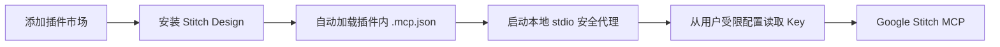

# Stitch Design 使用指南

## 先理解三件事

插件市场、插件和 Stitch 凭据是三个独立层次：



- “添加插件市场”只把 GitHub 仓库加入插件来源。
- 安装插件时会自动加载 `.mcp.json`；“安装 Stitch Design”同时安装 Skills，用户不需要再次填写 MCP URL。
- Google Stitch 仍然需要识别调用者。本地 Codex 使用用户自己的 `STITCH_API_KEY`。

Stitch SDK 不会消除凭据要求。官方教程所说的“不需要 MCP 配置文件”，表示 SDK 封装了 MCP 连接；SDK 仍然需要 `STITCH_API_KEY`，并使用它连接 Stitch MCP。

## 本地 Codex CLI：推荐流程

1. 添加市场并安装插件：

   ```bash
   codex plugin marketplace add partme-ai/partme-stitch-plugin --ref main
   codex plugin add stitch-design@partme-ai-stitch
   ```

2. 在 [Stitch Settings](https://stitch.withgoogle.com/settings) 创建 API key。
3. 第一次使用时，`stitch-local-setup` 会打开本地单卡片 Token 设置页面：

   macOS / Linux：

   ```bash
   python /absolute/plugin/root/scripts/stitch_setup.py ui
   ```

   Windows：

   ```powershell
   python C:\absolute\plugin\root\scripts\stitch_setup.py ui
   ```

   配置器使用隐藏输入，不修改 shell 或 PowerShell Profile。所有平台默认写入当前用户的受限配置文件：Unix 为 `$XDG_CONFIG_HOME/stitch-design/credentials.json`（未设置时使用 `~/.config/...`），Windows 为 `%APPDATA%\stitch-design\credentials.json`。

4. 此后由配置器启动 Codex，它会读取凭据并仅注入子进程：

   ```bash
   python /absolute/plugin/root/scripts/stitch_setup.py cli
   ```

5. 在新任务中输入：“只读列出我的 Stitch 项目”。空列表也是有效结果，不要为了验证而创建项目。

普通用户不需要克隆插件仓库；首次设置 Skill 会给出已安装插件中的真实脚本路径。Windows 同样使用 `python` 命令。所有支持的宿主都必须确保 PATH 中的 `python` 解析为 Python 3.11 或更高版本。已克隆仓库的开发者也可使用 Unix 包装器 `./scripts/stitch_setup.sh`。

## 自定义启动命令与桌面端

需要启动其他本地客户端时使用：

```bash
python /absolute/plugin/root/scripts/stitch_setup.py run -- /path/to/client
```

macOS 的 `desktop` 快捷命令会启动 `/Applications/ChatGPT.app`。Windows/Linux 的安装位置不固定，因此使用 `run -- <桌面程序路径>`，不猜测路径。

## 自助检查

```bash
python /absolute/plugin/root/scripts/stitch_setup.py check
```

检查只报告 key 是否可由当前环境或用户配置取得，绝不输出 key 的值；同时检查插件包中的 MCP 配置文件。

## ChatGPT 网页版

理想流程是“安装 → 点击连接 → 授权 → 使用”，普通用户不应向聊天或插件表单粘贴 API key。

当前 ChatGPT 网页版路径尚未通过端到端验证：开发者模式能够注册 Stitch MCP 并发现工具，但实测 `list_projects` 在完成连接后仍无响应。因此本版本不把网页连接标记为正式可用，也不启用可能绕过本地密钥保护的 portable manifests。

只有以下任一路径完成验证后，才应开放正式网页流程：

- Stitch MCP 提供 ChatGPT 可完成的用户级 OAuth；
- OpenAI 提供适用于 portable plugin 的安全凭据引用；
- 受控网关实现每用户凭据隔离、撤销、审计和端到端验证。

不得在插件包中内置共享 Stitch API key。共享 key 会让不同用户共用身份、项目访问范围和额度。

## 故障排查

- “找不到 Stitch 工具”：确认插件已启用，重启应用并新建任务。
- “认证失败”：在 Stitch Settings 检查 key，重新运行启动脚本。
- “`STITCH_API_KEY is not set`”：不要把 key 作为命令参数；在交互式终端运行启动脚本。
- 写操作超时：先使用 `get_project`、`get_screen` 等只读工具确认状态，不直接重复写操作。
