# Stitch Design 0.6.0 Live Smoke Acceptance

> Repository preparation: complete
>
> Provider + asset live smoke: not executed
>
> Harness acceptance: not executed
>
> Release/Marketplace: not published

[简体中文](live-canary-acceptance.zh_CN.md) | [Harness controller](live-harness-controller.md) | [Architecture](Stitch-Design-Architecture.md)

This register separates two different external gates. The manual GitHub workflow is a bounded Google Stitch provider + local asset smoke; it is not Harness acceptance and it does not fabricate automated user approval. The full Delivery Harness remains an interactive local controller path.

## Prepared provider + asset smoke

The `Live Provider and Asset Smoke` workflow (`live-canary.yml`) has only `workflow_dispatch`. It reads `STITCH_API_KEY` only from the same-name Repository Secret and creates a uniquely titled temporary project.

```mermaid
flowchart LR
    Dispatch["Manual dispatch"] --> Protocol["initialize · initialized · paged tools/list"]
    Protocol --> Catalog["15 provider + 2 local tools"]
    Catalog --> Project["Unique temporary project"]
    Project --> Screen["Generate · read · edit · one variant"]
    Screen --> System["Create · update · list · apply design system"]
    System --> Assets["Upload · verified download"]
    Assets --> Cleanup["always: delete once · read absence probe"]
```

The live backend requires matching JSON-RPC IDs, no JSON-RPC error, `isError != true`, structured tool content, and per-tool output contracts. Every screen/asset response is bound to the exact private project, screen, or design-system identity. If project creation is unknown, the backend reads projects and accepts only exactly one exact-title match. It never records a project identity from zero or multiple matches.

Opaque identities remain in a runner-private `0600` file and are not uploaded. Public evidence has an exact schema containing only booleans, positive acceptance counts, one aggregate SHA-256, and UTC timestamps. Schema validation and acceptance validation are separate: schema-valid partial evidence is not an accepted smoke.

The final `always()` step is the sole delete site. It checkpoints `delete_attempted` before the call and never replays it. Whether delete succeeds, fails, or has an unknown result, a fresh `list_projects` probe must prove the exact project resource absent. Failure to prove absence leaves `project_absent: false` and fails acceptance.

`actions/checkout@v4` and `actions/setup-python@v5` remain moving major-version references because their immutable commit SHAs were not independently verified in this repository-preparation task. Checkout uses `persist-credentials: false`; the controller should pin independently verified SHAs before treating action provenance as release evidence.

## Separate Harness gate

After this smoke passes, run the [local Harness controller](live-harness-controller.md) from the installed 0.6.0 candidate. That path must obtain actual Stitch, ImageGen, OCR/business, roundtrip, editability, comparison, explicit human approval, and archive receipts. Neither manual workflow dispatch nor a green provider smoke counts as explicit human approval of Harness artifacts.

## Acceptance ledger

| Gate | Current result | Required evidence |
|:---|:---|:---|
| Manual-only workflow and secret scope | Prepared offline | workflow tests + actionlint |
| MCP lifecycle and exact 17-tool catalog | Prepared with recording fake | live matching responses |
| Provider generate/read/edit/one variant | Pending live smoke | all booleans true; positive screen counts |
| Design-system create/update/list/apply | Pending live smoke | bound identity results; positive count |
| Local upload/download | Pending live smoke | positive counts + download manifest hash |
| Delete and prove absence | Pending live smoke | `delete_requested` and `project_absent` true |
| Full Delivery Harness | Pending local controller | real receipts + explicit human approval + verified archive |
| 0.6.0 tag/Release/Marketplace/install | Not published | exact source/remote/tag/release/install equality |

Until every applicable gate is closed, 0.6.0 remains a local candidate and v0.5.4 remains the published baseline.
