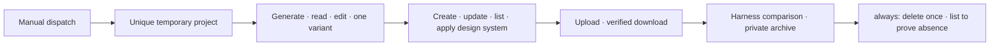

# Stitch Design 0.6.0 Live Canary Acceptance

> Repository preparation: complete
>
> Live Canary: not executed
>
> Release/Marketplace: not published

[简体中文](live-canary-acceptance.zh_CN.md) | [Architecture](Stitch-Design-Architecture.md) | [Technical solution](Stitch-Design-Technical-Solution.md)

This document is the acceptance register for the 0.6.0 candidate. It does not claim a remote run, release, Marketplace upgrade, or installed-host proof. The controller must replace the pending rows only after observing the corresponding external evidence.

## Prepared control

The `Live Canary` GitHub Actions workflow is manual-only (`workflow_dispatch`). It reads `STITCH_API_KEY` exclusively from the repository secret of the same name, creates a unique `codex-stitch-canary-<UTC>-<nonce>` project, and runs one bounded chain:

The private runner state contains the remote identifiers required for cleanup and is written with mode `0600`. It is not uploaded. Public logs contain only stage booleans, non-negative counts, SHA-256 values, and UTC timestamps. Credentials, project/screen identifiers, signed URLs, HTML, screenshots, and private archive contents are excluded.

The final workflow step uses `always()` and is the only delete site. It checkpoints `delete_attempted` before calling `delete_project`, so an ambiguous response is not blindly replayed. A read-only `list_projects` reconciliation must prove absence; otherwise the workflow fails and a maintainer must inspect the remote account without resubmitting the delete automatically.

## Controller runbook

1. Configure the repository secret `STITCH_API_KEY`; do not add a workflow input, repository variable, checked-in file, or command-line value containing the credential.
2. Dispatch `Live Canary` once from the exact 0.6.0 candidate commit. Do not enable push, pull-request, schedule, or reusable-workflow triggers.
3. Confirm every non-cleanup stage reports `true`, downloaded/comparison counts are positive, and the private archive hash is a 64-character SHA-256 value.
4. Confirm the final cleanup reports both `delete_requested: true` and `project_absent: true`.
5. Record the run URL, candidate commit, and final sanitized JSON in the release controller's private acceptance record. Do not copy opaque identifiers or private artifacts into public release notes.
6. Only after independent review and all release gates pass may the controller push/tag/release 0.6.0, upgrade Marketplace, and prove source/remote/tag/release/install equality.

## Acceptance ledger

| Gate | Current result | Required evidence |
|:---|:---|:---|
| Manual-only workflow | Prepared offline | `actionlint` and workflow contract tests |
| Secret-only authentication | Prepared offline | repository secret mapping; no credential input or argv value |
| Unique temporary project | Prepared offline | private runner state; public boolean only |
| Generate/read/edit/one variant | Pending live run | sanitized stage booleans |
| Design-system create/update/list/apply | Pending live run | sanitized stage booleans |
| Local upload/download | Pending live run | booleans plus downloaded-file count |
| Harness comparison/private archive | Pending live run | comparison count plus archive SHA-256 |
| Delete and prove absence | Pending live run | final cleanup booleans |
| 0.6.0 tag/Release/Marketplace/install | Not published | exact SHA and installed-source equality |

Until every pending row is closed, 0.6.0 remains a local candidate and v0.5.4 remains the published baseline.
