# Stitch Design Live Smoke Acceptance

> Repository preparation: complete
>
> Provider + asset live smoke: passed locally on 2026-09-14 (0.6.0 candidate)
>
> Harness acceptance: passed and archived locally
>
> GitHub Release/repo Marketplace: v0.7.1 published

[简体中文](live-canary-acceptance.zh_CN.md) | [Harness controller](live-harness-controller.md) | [Architecture](Stitch-Design-Architecture.md)

The provider contract measured below is unchanged, so this smoke remains the applicable provider evidence. The Harness contract changed in 0.7.0 and is unchanged in 0.7.1: page specs require `canvas.device`, and the device-fidelity gate fails a screen whose provider device or geometry does not match the requested canvas. The live run recorded here predates that gate, so re-run the local Harness controller on 0.7.1 with specs that declare `canvas.device`. The tablet screens recorded in the 0.6.x evidence came back as DESKTOP from the provider and are rejected by the gate by design. 0.7.1 itself only widens the download allowlist and adds its boundary tests.

This register separates two different external gates. The manual GitHub workflow is a bounded Google Stitch provider + local asset smoke; it is not Harness acceptance and it does not fabricate automated user approval. The full Delivery Harness remains an interactive local controller path.

The local live run completed every provider/asset stage, observed one read screen, one variant, one design-system result, one uploaded screen and two downloaded files, and produced download-manifest SHA-256 `d482d52c666bf0df56ded9e8adb1923c93a24106dd87f8ce3000d95d38626df4`. Cleanup recorded both `delete_requested: true` and `project_absent: true`; schema and acceptance validators passed. Opaque resource identities and the API key were not included in public evidence.

## Prepared provider + asset smoke

The `Live Provider and Asset Smoke` workflow (`live-canary.yml`) has only `workflow_dispatch`. It reads `STITCH_API_KEY` only from the same-name Repository Secret and creates a uniquely titled temporary project.

```mermaid
flowchart LR
    Dispatch["Manual dispatch"] --> Protocol["initialize · initialized · paged tools/list"]
    Protocol --> Catalog["15 provider + 2 local tools"]
    Catalog --> Project["Unique temporary project"]
    Project --> Screen["Generate · read · edit · one variant"]
    Screen --> System["Create · update · list · apply design system"]
    System --> Assets["Upload · verified download"]
    Assets --> Cleanup["always: delete once · read absence probe"]
```

The live backend requires matching JSON-RPC IDs, no JSON-RPC error, `isError != true`, structured tool content, and per-tool output contracts. Every screen/asset response is bound to the exact private project, screen, or design-system identity. If project creation is unknown, the backend reads projects and accepts only exactly one exact-title match. It never records a project identity from zero or multiple matches.

Opaque identities remain in a runner-private file and are not uploaded. POSIX explicitly uses mode `0600`; Windows relies on the current-user runner temp/profile ACL and does not apply POSIX mode bits. Public evidence has an exact schema containing only booleans, positive acceptance counts, one aggregate SHA-256, and UTC timestamps. Schema validation and acceptance validation are separate: schema-valid partial evidence is not an accepted smoke.

The final `always()` step is the sole delete site. If `project_name` was not checkpointed, cleanup uses the private unique `project_title` for up to three read-only reconciliation attempts with a two-second backoff. Exactly one valid match is checkpointed before one delete; zero or multiple matches remain unknown and fail closed. The delete attempt is checkpointed and never replayed. Whether delete succeeds, fails, or has an unknown result, bounded fresh `list_projects` probes must prove the exact project resource absent. Failure to prove absence leaves `project_absent: false` and fails acceptance.

Every action reference in both workflows is pinned to an immutable commit SHA: `actions/checkout@11d5960a326750d5838078e36cf38b85af677262` (v4.4.0) and `actions/setup-python@a26af69be951a213d495a4c3e4e4022e16d87065` (v5.6.0). Checkout uses `persist-credentials: false`. Upgrading to a later major version is a separate change that must re-pin the SHAs rather than reintroduce a moving tag.

## Separate Harness gate

After this smoke passes, run the [local Harness controller](live-harness-controller.md) from the installed 0.7.1 candidate. That path must obtain actual Stitch, ImageGen, OCR/business, roundtrip, editability, comparison, explicit human approval, and archive receipts. Neither manual workflow dispatch nor a green provider smoke counts as explicit human approval of Harness artifacts.

## Acceptance ledger

| Gate | Current result | Required evidence |
|:---|:---|:---|
| Manual-only workflow and secret scope | Verified offline | workflow tests + actionlint; all six action references pinned to immutable commit SHAs |
| MCP lifecycle and exact 17-tool catalog | Passed locally | live matching responses |
| Provider generate/read/edit/one variant | Passed locally | one same-project variant identity different from its source |
| Design-system create/update/list/apply | Passed locally | bound identity results; positive count |
| Local upload/download | Passed locally | upload 1; download 2; manifest hash recorded |
| Delete and prove absence | Passed locally | `delete_requested` and `project_absent` true |
| Full Delivery Harness | Passed locally | real receipts + explicit human approval + verified archive |
| 0.7.1 tag/Release/repo Marketplace/install | Published | exact source/remote/tag/release/install equality |

Version 0.7.1 is the current GitHub/repo Marketplace release. Publication to the universal public Plugins Directory remains a separate OpenAI submission gate.

## Post-release verification for 0.7.1 (2026-09-14)

- **Source equality at the release commit:** tag `v0.7.1`, the marketplace tracking clone, and the installed cache all resolve to `1314155`. `origin/main` was also `1314155` when the release was cut and has since advanced only by this record, so the tag and the installed copy remain the release reference.
- **Installed artifact parity at `1314155`:** all 438 tracked files were byte-identical between the repository tree and the installed copy; the installed manifest reports 0.7.1, and no 0.7.0 install remains.
- **Installed copy self-check:** the installed distribution validator reports 0.7.1, the allowlist tests pass from the installed copy, `stitch.withgoogle.com` is accepted, and a lookalike host is rejected.
- **Marketplace refresh:** the first `marketplace upgrade` failed with a transient `fatal: early EOF` and left the tracking clone at `e86b8b0`; a retry upgraded it to `1314155`, and the plugin was reinstalled so the cache matches the tracking clone.
- **Continuous integration:** the `Validate` workflow completed successfully on both `main` and the `v0.7.1` tag.
- **Fresh-task exposure: BLOCKED by the environment, not verified.** In fresh ephemeral tasks the model saw only the bundled `mcp__cua_repl__*` tools; none of the ten configured user and plugin MCP servers were exposed, so no Stitch tool could be called. This is not specific to this plugin: the same probes reported no tools for any user-configured server, the process stderr is byte-identical to an earlier run in which the call succeeded, `codex mcp list` still lists every server, `codex mcp get stitch` points at the installed 0.7.1 proxy, and driving that proxy directly returns the full 17-tool catalog. Re-run this check after restarting Codex; the 0.7.0 exposure check passed earlier the same day.

## Post-release verification for 0.7.0 (2026-09-14)

- **Source equality at the release commit:** tag `v0.7.0`, the marketplace tracking clone refreshed for this release, and the installed cache all resolve to `e86b8b0`. `origin/main` was also `e86b8b0` when the release was cut and has since advanced only by this verification record, so the tag and the installed copy remain the release reference.
- **Installed artifact parity at `e86b8b0`:** all 437 tracked files were byte-identical between the repository tree and the installed copy; the installed manifest reports 0.7.0, and no 0.6.x install remains.
- **Fresh-task exposure:** a new ephemeral task exposed and successfully called `mcp__stitch__list_projects` through the plugin-owned stdio proxy with `STITCH_API_KEY` unset, so the credential came from the restricted user configuration.
- **Continuous integration:** the `Validate` workflow completed successfully on both `main` and the `v0.7.0` tag.
- **Device gate against the recorded fallback:** feeding the tablet screens observed in the reported project (`DESKTOP` 2560x2048) into the gate against a `TABLET` 768x1024 canvas fails all three, while the shipped mobile screen (`MOBILE` 780x1768 against 390x884) passes at scale 2.

## Post-release verification for 0.6.1 (2026-09-14)

- **Source equality at the release commit:** tag `v0.6.1`, the marketplace tracking clone refreshed for this release, and the installed cache all resolve to `40d9255`. `origin/main` was also `40d9255` when the release was cut and has since advanced only by this verification record, so the tag and the installed copy remain the release reference.
- **Installed artifact parity at `40d9255`:** all 435 tracked files were byte-identical between the repository tree and the installed copy; the installed manifest reports 0.6.1, and no 0.6.0 install remains.
- **Fresh-task exposure:** a new ephemeral task exposed and successfully called `mcp__stitch__list_projects` through the plugin-owned stdio proxy with `STITCH_API_KEY` unset, so the credential came from the restricted user configuration rather than the process environment.
- **Tool catalog:** driving the installed `scripts/stitch_mcp_proxy.py` directly returned the exact 17-tool catalog (15 provider tools plus the two namespaced local tools).
- **Continuous integration:** the `Validate` workflow completed successfully on both `main` and the `v0.6.1` tag.
- **Credential provenance:** no `stitch` MCP entry and no literal API key header remain in the user configuration, so the effective server is the plugin-owned stdio proxy; the restricted credential file is `0700`/`0600`.
