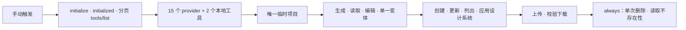

# Stitch Design 真实 Smoke 验收

> 仓库准备：已完成
>
> Provider + asset 真实 smoke：2026-09-14 本机通过（0.6.0 候选）
>
> Harness 验收：本机通过并归档
>
> GitHub Release/仓库 Marketplace：v0.6.1 已发布

[English](live-canary-acceptance.md) | [Harness 控制器](live-harness-controller.zh_CN.md) | [架构文档](Stitch-Design-Architecture.zh_CN.md)

下列 provider 与 Harness 运行时在 0.6.1 中未变。0.6.1 把 workflow action 固定到不可变 commit SHA、让本地设置 Skill 与 `check` 命令契约对齐，并更新发布校验器与本 smoke 记录的版本常量。provider、Harness 与门禁行为均未改变，因此这里记录的真实证据仍是 0.6.1 适用的验收结论。

本台账把两个外部门禁明确分开。手动 GitHub workflow 是有界 Google Stitch provider + 本地资产 smoke；它不是 Harness 验收，也不会伪造自动用户批准。完整 Delivery Harness 必须走本地交互式控制器路径。

本机真实运行已完成全部 provider/asset 阶段，观测到读取屏幕 1、变体 1、设计系统结果 1、上传屏幕 1、下载文件 2，并生成下载清单 SHA-256 `d482d52c666bf0df56ded9e8adb1923c93a24106dd87f8ce3000d95d38626df4`。清理记录为 `delete_requested: true` 与 `project_absent: true`，schema 和 acceptance 校验均通过；公开 evidence 不包含 API Key 或 opaque 资源身份。

## 已准备的 provider + asset smoke

`Live Provider and Asset Smoke` workflow（`live-canary.yml`）只有 `workflow_dispatch` 触发器，只从同名 Repository Secret 读取 `STITCH_API_KEY`，并创建唯一标题的临时项目。

真实 backend 要求 JSON-RPC ID 精确匹配、无 JSON-RPC error、`isError != true`、结构化工具内容以及逐工具输出合同。每个屏幕和资产结果都绑定私有状态中的精确项目、屏幕或设计系统身份。项目创建结果不明时，只读列出项目并且只接受唯一一个标题精确相等的结果；零个或多个匹配都不会写入项目身份。

Opaque ID 仅保存在 runner 私有文件且不上传。POSIX 显式使用 `0600`；Windows 依赖当前用户 runner temp/profile ACL，不应用 POSIX mode bits。公开 evidence 使用精确 schema，仅包含布尔值、验收所需正数计数、一个聚合 SHA-256 和 UTC 时间戳。schema 校验与 acceptance 校验相互独立：结构合法的部分 evidence 不等于 smoke 已验收。

最后一个 `always()` 步骤是唯一删除入口。如果尚未落盘 `project_name`，清理会使用私有唯一 `project_title`，以两秒退避最多执行三次只读对账。只有精确一个合法匹配才先落盘身份再执行一次删除；零个或多个匹配都保持 unknown 并失败关闭。删除尝试先落盘且不重放。无论删除成功、失败还是结果不明，都用有界的新 `list_projects` 探针证明精确项目资源不存在；无法证明时保留 `project_absent: false` 并让验收失败。

两个 workflow 中的 action 引用均已固定到不可变 commit SHA：`actions/checkout@11d5960a326750d5838078e36cf38b85af677262`（v4.4.0）与 `actions/setup-python@a26af69be951a213d495a4c3e4e4022e16d87065`（v5.6.0）。checkout 已设置 `persist-credentials: false`。升级到更高的 major 版本属于独立变更，必须重新固定 SHA，不得退回可移动 tag。

## 独立 Harness 门禁

provider smoke 通过后，从已安装的 0.6.1 候选执行[本地 Harness 控制器](live-harness-controller.zh_CN.md)。该路径必须取得真实 Stitch、ImageGen、OCR/业务、roundtrip、editability、comparison、明确人工批准及 archive receipts。手动触发 workflow 或 provider smoke 通过都不等于用户明确批准 Harness 资产。

## 验收台账

| 门禁 | 当前结果 | 所需证据 |
|:---|:---|:---|
| 仅手动触发与 Secret 范围 | 已离线验证 | workflow 测试 + actionlint；六处 action 引用全部固定到不可变 commit SHA |
| MCP 生命周期与精确 17 工具目录 | 本机通过 | 真实匹配响应 |
| Provider 生成/读取/编辑/单一变体 | 本机通过 | 一个同项目且不同于源屏幕身份的变体 |
| 设计系统创建/更新/列出/应用 | 本机通过 | 身份绑定结果；计数为正 |
| 本地上传/下载 | 本机通过 | 上传 1；下载 2；已记录清单哈希 |
| 删除并证明不存在 | 本机通过 | `delete_requested` 与 `project_absent` 均为 true |
| 完整 Delivery Harness | 本机通过 | 真实 receipts + 明确人工批准 + 已验证归档 |
| 0.6.1 标签/Release/仓库 Marketplace/安装 | 已发布 | 精确源码/远端/标签/Release/安装源等价性 |

0.6.1 是当前 GitHub/仓库 Marketplace 正式版本。Universal 公共 Plugins Directory 仍是独立的 OpenAI 提交门禁。

## 发布后验证（2026-09-14）

- **发布提交处的源码等价性：** 标签 `v0.6.1`、本次刷新后的 marketplace 跟踪副本、已安装缓存均指向 `40d9255`。发布时 `origin/main` 同为 `40d9255`，其后仅增加了本验证记录，因此标签与已安装副本仍是该发布版本的基准。
- **`40d9255` 处的安装产物一致性：** 仓库树与已安装副本的全部 435 个受跟踪文件逐字节一致；安装清单为 0.6.1，且不存在残留的 0.6.0 安装。
- **新任务工具暴露：** 新建 ephemeral 任务成功暴露并调用了 `mcp__stitch__list_projects`，且 `STITCH_API_KEY` 未设置，说明凭据来自受限的用户配置而非进程环境；调用经由插件自带的 stdio 代理。
- **工具清单：** 直接驱动已安装的 `scripts/stitch_mcp_proxy.py` 返回精确的 17 个工具（15 个 provider 工具 + 2 个带命名空间的本地工具）。
- **持续集成：** `Validate` workflow 在 `main` 与 `v0.6.1` 标签上均成功完成。
- **凭据来源：** 用户配置中不再存在 `stitch` MCP 条目与字面 API key 请求头，因此生效服务是插件自带的 stdio 代理；受限凭据文件权限为 `0700`/`0600`。
