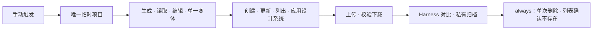

# Stitch Design 0.6.0 真实 Canary 验收

> 仓库准备：已完成
>
> 真实 Canary：未执行
>
> Release/Marketplace：未发布

[English](live-canary-acceptance.md) | [架构文档](Stitch-Design-Architecture.zh_CN.md) | [技术方案](Stitch-Design-Technical-Solution.zh_CN.md)

本文是 0.6.0 候选版本的验收登记，不代表已经完成远端运行、GitHub Release、Marketplace 升级或安装宿主验证。控制器只有在观察到对应外部证据后，才能关闭待验收项。

## 已准备的控制面

`Live Canary` GitHub Actions 工作流仅支持手动触发（`workflow_dispatch`）。它只从同名 Repository Secret 读取 `STITCH_API_KEY`，创建唯一的 `codex-stitch-canary-<UTC>-<nonce>` 临时项目，并执行一次有界主链：

包含远端 ID 的 runner 私有状态使用 `0600` 权限写入且不上传。公共日志仅包含阶段布尔值、非负计数、SHA-256 与 UTC 时间戳，不包含凭据、项目/屏幕 ID、签名 URL、HTML、截图或私有归档内容。

最后一个 workflow 步骤使用 `always()`，也是唯一删除入口。删除前先持久化 `delete_attempted`；如果响应不明，不会盲目重放删除。随后必须通过只读 `list_projects` 证明目标不存在，否则 workflow 失败，由维护者在远端账号内人工核查。

## 控制器操作手册

1. 配置 Repository Secret `STITCH_API_KEY`；不得改成 workflow 输入、Repository Variable、仓库文件或命令行值。
2. 从精确的 0.6.0 候选提交手动触发一次 `Live Canary`；不得启用 push、pull request、schedule 或 reusable workflow 触发。
3. 确认全部非清理阶段为 `true`，下载/对比计数为正数，私有归档哈希为 64 位 SHA-256。
4. 确认最后清理结果同时为 `delete_requested: true` 与 `project_absent: true`。
5. 在发布控制器的私有验收记录中登记 run URL、候选提交和最终脱敏 JSON；公共 Release Notes 不复制 opaque ID 或私有资产。
6. 只有在独立审查和全部发布门禁通过后，控制器才可 push/tag/release 0.6.0、升级 Marketplace，并验证源码/远端/标签/Release/安装源 SHA 相等。

## 验收台账

| 门禁 | 当前结果 | 所需证据 |
|:---|:---|:---|
| 仅手动触发 | 已完成离线准备 | `actionlint` 与 workflow 合同测试 |
| 仅 Repository Secret 认证 | 已完成离线准备 | Secret 映射；无凭据输入与 argv 值 |
| 唯一临时项目 | 已完成离线准备 | runner 私有状态；公开侧仅布尔值 |
| 生成/读取/编辑/单一变体 | 待真实运行 | 脱敏阶段布尔值 |
| 设计系统创建/更新/列出/应用 | 待真实运行 | 脱敏阶段布尔值 |
| 本地上传/下载 | 待真实运行 | 布尔值与下载文件计数 |
| Harness 对比/私有归档 | 待真实运行 | 对比计数与归档 SHA-256 |
| 删除并证明不存在 | 待真实运行 | 最终清理布尔值 |
| 0.6.0 标签/Release/Marketplace/安装 | 未发布 | 精确 SHA 与安装源等价性 |

所有待验收项关闭前，0.6.0 仍是本地候选，v0.5.4 仍是已发布基线。
