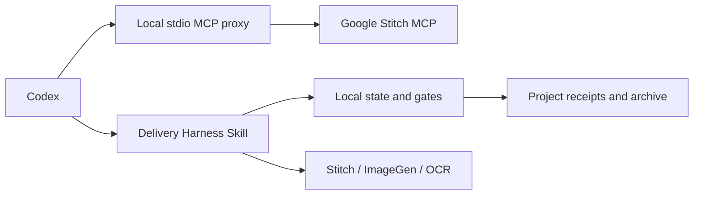

# Stitch Delivery Harness Implementation Plan

> **For agentic workers:** REQUIRED SUB-SKILL: Use superpowers:subagent-driven-development (recommended) or superpowers:executing-plans to implement this plan task-by-task. Steps use checkbox (`- [ ]`) syntax for tracking.

**Goal:** Build a secure, resumable Stitch delivery Harness that produces verified editable HTML, an art-enhanced image, comparison evidence, explicit user approval, and a traceable archive.

**Architecture:** A Python standard-library core owns page contracts, state transitions, receipts, hashes, deterministic gates, recovery, and archival. A separate local stdio MCP proxy owns Google Stitch authentication and transport. Agent Skills invoke the real Stitch, ImageGen, and OCR/visual tools, then feed their artifact paths and provider metadata into the Harness; the Harness never fabricates an external result.

**Tech Stack:** Python 3.11+ standard library, MCP Streamable HTTP over stdio/HTTPS, HTMLParser, unittest, optional Pillow installed into a user-scoped Harness environment, Agent Skills, Mermaid documentation.

**Spec:** `docs/superpowers/specs/2026-09-13-stitch-delivery-harness-design.md`

## Global Constraints

- The reusable implementation belongs to `codex-stitch-design-plugin`; WeKefu stores only project contracts, run evidence, candidate artifacts, and approved artifacts.
- Never expose an API key in config, argv, stdout, stderr, receipts, reports, or Git.
- The only accepted Stitch endpoint is `https://stitch.googleapis.com/mcp`; credentials must never follow redirects to another origin.
- A remote write with an unknown result is reconciled by read operations before any retry.
- A file, HTTP success, OCR pass, or model score cannot independently mark a run complete.
- `approve` requires an explicit user decision and exact hashes of every approved artifact.
- WeKefu login acceptance uses exactly 1350×768 at scale 1.
- Existing `.stitch/loops/` content remains read-only unless an explicit import is run.
- Moving an image already referenced in a conversation leaves a verified relative symlink at the original path.
- Do not push, publish, install a Marketplace update, or delete legacy credentials without separate authorization.

---

### Task 1: Secure secret providers and one-time legacy migration

**Files:**
- Create: `stitch_harness/__init__.py`
- Create: `stitch_harness/secrets.py`
- Create: `tests/test_harness_secrets.py`
- Modify: `scripts/stitch_setup.py`
- Modify: `tests/test_stitch_setup.py`

**Interfaces:**
- Produces: `SecretProvider.get() -> str | None`
- Produces: `SecretProvider.set(value: str) -> None`
- Produces: `platform_secret_provider() -> SecretProvider`
- Produces: `migrate_legacy_key(source: Path, provider: SecretProvider) -> MigrationResult`
- Preserves: environment variable precedence for an explicitly launched process

- [ ] **Step 1: Write failing provider and migration tests**

```python
def test_environment_provider_has_precedence_without_printing_secret(self):
    provider = CompositeSecretProvider([
        EnvironmentSecretProvider({"STITCH_API_KEY": "env-secret"}),
        FakeSecretProvider("stored-secret"),
    ])
    self.assertEqual(provider.get(), "env-secret")

def test_legacy_file_is_scrubbed_only_after_verified_store(self):
    source = self.root / "credentials.json"
    source.write_text('{"STITCH_API_KEY":"legacy-secret"}\n')
    provider = FakeSecretProvider()
    result = migrate_legacy_key(source, provider)
    self.assertEqual(provider.get(), "legacy-secret")
    self.assertNotIn("STITCH_API_KEY", source.read_text())
    self.assertTrue(result.migrated)

def test_failed_secret_store_preserves_legacy_file(self):
    source = self.root / "credentials.json"
    source.write_text('{"STITCH_API_KEY":"legacy-secret"}\n')
    with self.assertRaises(SecretStoreError):
        migrate_legacy_key(source, FailingSecretProvider())
    self.assertIn("legacy-secret", source.read_text())
```

- [ ] **Step 2: Run the tests to verify RED**

```bash
python3 -m unittest -v tests.test_harness_secrets tests.test_stitch_setup
```

Expected: FAIL because `stitch_harness.secrets` and system-backed providers do not exist.

- [ ] **Step 3: Implement the provider boundary**

Implement `MacOSKeychainProvider` with `/usr/bin/security`, `WindowsCredentialProvider` with PowerShell Credential Manager APIs when available, and `LinuxSecretServiceProvider` with `secret-tool`. Pass secrets through child stdin or a private environment value; never place them in argv. `CompositeSecretProvider` checks explicit process environment first and then the platform store.

The macOS service/account contract is:

```python
KEYCHAIN_SERVICE = "com.partme.stitch-design"
KEYCHAIN_ACCOUNT = getpass.getuser()
```

Keep legacy JSON loading solely for migration. Save to the system store, read it back using constant-time comparison, then atomically replace the legacy file with `{"migrated_to":"system-secret-store"}`. On any failure, leave the original file unchanged.

- [ ] **Step 4: Update the setup UI backend**

Change `/api/save`, `setup`, `check`, `command_environment`, and launch paths to use `platform_secret_provider()`. Responses state only configured/not configured. Add a separate, explicit `migrate` command; do not migrate merely because `check` ran.

- [ ] **Step 5: Verify GREEN and secret-free output**

```bash
python3 -m unittest -v tests.test_harness_secrets tests.test_stitch_setup tests.test_distribution
python3 scripts/stitch_setup.py check
git diff --check
```

Expected: tests pass; `check` reports only the provider and boolean state; no test secret appears in captured output.

- [ ] **Step 6: Commit the task**

```bash
git add stitch_harness/__init__.py stitch_harness/secrets.py scripts/stitch_setup.py tests/test_harness_secrets.py tests/test_stitch_setup.py
git commit -m "feat: store Stitch credentials in system secret stores"
```

---

### Task 2: Local stdio-to-HTTP Stitch MCP proxy

**Files:**
- Create: `stitch_harness/mcp_proxy.py`
- Create: `scripts/stitch_mcp_proxy.py`
- Create: `tests/test_mcp_proxy.py`
- Modify: `.mcp.json`
- Modify: `scripts/validate_distribution.py`
- Modify: `tests/test_distribution.py`

**Interfaces:**
- Produces: `McpHttpSession.send(message: dict) -> list[dict]`
- Produces: `serve_stdio(input_stream, output_stream, session) -> int`
- Consumes: `platform_secret_provider()`
- Preserves: upstream JSON-RPC IDs, MCP session ID, protocol version, notifications, JSON and SSE responses

- [ ] **Step 1: Write a fake upstream MCP server and failing transport tests**

```python
def test_initialize_injects_key_and_forwards_session(self):
    response = self.proxy.send({
        "jsonrpc": "2.0", "id": 1, "method": "initialize",
        "params": {"protocolVersion": "2025-06-18", "capabilities": {}, "clientInfo": {"name": "test", "version": "1"}},
    })
    self.assertEqual(response[0]["id"], 1)
    self.assertEqual(self.upstream.last_headers["X-Goog-Api-Key"], "test-secret")
    self.assertEqual(self.proxy.session_id, "session-1")

def test_notification_with_accepted_empty_body_emits_no_jsonrpc_message(self):
    messages = self.proxy.send({"jsonrpc": "2.0", "method": "notifications/initialized"})
    self.assertEqual(messages, [])

def test_unauthorized_refreshes_secret_once(self):
    provider = RotatingFakeSecretProvider(["expired", "fresh"])
    self.assertTrue(build_proxy(provider, self.upstream.url).send(self.request))
    self.assertEqual(provider.read_count, 2)

def test_write_timeout_is_not_retried(self):
    with self.assertRaises(UnknownWriteResult):
        self.proxy.send(self.generate_screen_request)
    self.assertEqual(self.upstream.request_count, 1)
```

Also assert SSE `event: message` parsing, malformed upstream JSON, HTTP 500 mapping, EOF shutdown, and that secret values never occur in stdout/stderr/exceptions.

- [ ] **Step 2: Run the tests to verify RED**

```bash
python3 -m unittest -v tests.test_mcp_proxy
```

Expected: FAIL because the proxy module and entrypoint do not exist.

- [ ] **Step 3: Implement the minimal protocol-safe proxy**

Use `urllib.request` with redirects disabled. Accept only the exact configured HTTPS origin. Send `Accept: application/json, text/event-stream`, `Content-Type: application/json`, `MCP-Protocol-Version`, `Mcp-Session-Id`, and the API key. Parse JSON or SSE into JSON-RPC messages. Preserve request IDs and write one compact JSON object per stdout line.

Read stdin line-by-line. Parse errors become JSON-RPC `-32700`; invalid request shapes become `-32600`. Sanitize URLs, headers, exception strings, and response excerpts before emitting an error. A 401/403 may refresh the secret and retry once. Network uncertainty on `tools/call` returns a dedicated unknown-result error without retry.

- [ ] **Step 4: Switch the compatibility MCP config to stdio**

The installed plugin must start the checked-in wrapper relative to the plugin root. Update `.mcp.json` to the compatibility-manifest form validated on the current Codex version:

```json
{
  "mcpServers": {
    "stitch": {
      "type": "stdio",
      "command": "python3",
      "args": ["scripts/stitch_mcp_proxy.py"],
      "cwd": "."
    }
  }
}
```

Codex resolves a plugin-provided relative `cwd` beneath the installed plugin root. The distribution test must require `cwd: "."`, and the disposable local installation test must confirm that `scripts/stitch_mcp_proxy.py` resolves from that directory on Codex 0.153.4.

- [ ] **Step 5: Verify GREEN with no key in configuration**

```bash
python3 -m unittest -v tests.test_mcp_proxy tests.test_distribution
python3 scripts/validate_distribution.py .
rg -n '(X-Goog-Api-Key|STITCH_API_KEY|AIza)' .mcp.json .codex-plugin scripts stitch_harness tests
git diff --check
```

Expected: all tests and validation pass; `.mcp.json` contains no literal or environment header mapping; `rg` finds only symbolic names and synthetic test values.

- [ ] **Step 6: Commit the task**

```bash
git add .mcp.json stitch_harness/mcp_proxy.py scripts/stitch_mcp_proxy.py scripts/validate_distribution.py tests/test_mcp_proxy.py tests/test_distribution.py
git commit -m "feat: proxy Stitch MCP through secure local stdio"
```

---

### Task 3: Page contracts, run state, and tamper-evident receipts

**Files:**
- Create: `stitch_harness/contracts.py`
- Create: `stitch_harness/state.py`
- Create: `stitch_harness/storage.py`
- Create: `tests/test_harness_contracts.py`
- Create: `tests/test_harness_state.py`
- Create: `tests/fixtures/page-spec.json`

**Interfaces:**
- Produces: `PageSpec.load(path: Path) -> PageSpec`
- Produces: `RunStore.start(project_root: Path, spec: PageSpec, now: datetime) -> Run`
- Produces: `RunStore.append_receipt(run: Run, receipt: Receipt) -> Run`
- Produces: `RunStore.verify_chain(run: Run) -> ChainVerification`
- Produces: `RunState` enum matching the approved state diagram

- [ ] **Step 1: Write failing contract and transition tests**

```python
def test_page_id_rejects_path_escape(self):
    with self.assertRaises(ContractError):
        PageSpec.from_dict({**VALID_SPEC, "page_id": "../login"})

def test_receipt_chain_rejects_modified_artifact(self):
    run = self.store.start(self.root, self.spec, FIXED_TIME)
    artifact = run.path / "artifacts" / "source.html"
    artifact.write_text("<main>first</main>")
    run = self.store.append_receipt(run, passed_source_receipt(artifact))
    artifact.write_text("<main>changed</main>")
    self.assertFalse(self.store.verify_chain(run).valid)

def test_cannot_skip_source_acceptance(self):
    run = run_in_state(RunState.STITCH_GENERATED)
    with self.assertRaises(InvalidTransition):
        transition(run, RunState.ART_GENERATED)
```

Cover invalid schemas, duplicate run IDs, atomic-write failure, previous-receipt hash mismatch, approval invalidation, and exit-code mapping.

- [ ] **Step 2: Run the tests to verify RED**

```bash
python3 -m unittest -v tests.test_harness_contracts tests.test_harness_state
```

Expected: FAIL because contracts, run storage, and transitions do not exist.

- [ ] **Step 3: Implement immutable domain models and validation**

Use frozen dataclasses and explicit parsing; do not silently ignore unknown required fields. Validate `page_id` with `^[a-z0-9]+(?:-[a-z0-9]+)*$`, positive integer canvas dimensions, scale `1`, unique assertion IDs, comparison ranges, and a project-relative archive path.

Use the exact states from the spec. Keep the transition map in one constant and require a passed receipt type for each forward transition. A failed or unknown receipt never advances state.

- [ ] **Step 4: Implement atomic run storage and receipt chaining**

Create `.stitch/runs/<UTC>-<page-id>/` with `manifest.json`, `artifacts/`, `receipts/`, and `comparison/`. Write canonical UTF-8 JSON with sorted keys, compute SHA-256 for inputs/outputs and the previous receipt, fsync the temporary file, then atomically replace.

`verify_chain` checks every receipt, previous hash, artifact path containment, file hash, MIME, dimensions where present, and approved hashes. A changed approved artifact returns `approval_invalidated=True` and the caller transitions to `AWAITING_USER_APPROVAL`.

- [ ] **Step 5: Verify GREEN**

```bash
python3 -m unittest -v tests.test_harness_contracts tests.test_harness_state
git diff --check
```

Expected: all contract, path, transition, atomicity, and tamper tests pass.

- [ ] **Step 6: Commit the task**

```bash
git add stitch_harness/contracts.py stitch_harness/state.py stitch_harness/storage.py tests/test_harness_contracts.py tests/test_harness_state.py tests/fixtures/page-spec.json
git commit -m "feat: add Stitch Harness contracts and receipt chain"
```

---

### Task 4: Deterministic HTML, size, copy, and business gates

**Files:**
- Create: `stitch_harness/html_gate.py`
- Create: `stitch_harness/business_gate.py`
- Create: `tests/test_html_gate.py`
- Create: `tests/fixtures/login-valid.html`
- Create: `tests/fixtures/login-flattened.html`
- Create: `tests/fixtures/login-promo-cards.html`

**Interfaces:**
- Produces: `validate_html(spec: PageSpec, html_path: Path, render_metadata: dict) -> GateResult`
- Produces: `validate_business_assertions(spec: PageSpec, document: HtmlDocument) -> GateResult`
- Produces: registered assertion type `dom-style`

- [ ] **Step 1: Write failing source-gate tests**

```python
def test_valid_login_source_passes(self):
    result = validate_html(self.spec, FIXTURES / "login-valid.html", {"width": 1350, "height": 768, "scale": 1})
    self.assertTrue(result.passed, result.failures)

def test_web_wrapper_dimensions_do_not_count_as_canvas(self):
    result = validate_html(self.spec, FIXTURES / "login-valid.html", {"width": 2560, "height": 2048, "contentWidth": 1350, "contentHeight": 768})
    self.assertFalse(result.passed)

def test_three_promo_cards_fail_unboxed_assertion(self):
    result = validate_business_assertions(self.spec, parse_html(FIXTURES / "login-promo-cards.html"))
    self.assertIn("promo-unboxed", result.failed_ids)
```

Also test missing fixed copy, forbidden text, path escape through asset URLs, one full-page image, Canvas-only markup, missing editable regions, and ambiguous selectors.

- [ ] **Step 2: Run the tests to verify RED**

```bash
python3 -m unittest -v tests.test_html_gate
```

Expected: FAIL because the HTML and business gates do not exist.

- [ ] **Step 3: Implement a normalized HTML document model**

Subclass `html.parser.HTMLParser` to retain tag hierarchy, attributes, normalized visible text, inline style declarations, and source locations. Reject documents whose meaningful content is a single image/Canvas, whose required regions are absent, or whose fixed copy recall is below 1.0.

Treat the supplied render metadata as authoritative for screenshot dimensions. Require exact width, height, and scale from the page spec; do not infer success from an outer screenshot or CSS viewport alone.

- [ ] **Step 4: Implement typed business assertions**

Register assertion handlers by exact type. The initial `dom-style` handler resolves a constrained selector subset (`[data-purpose='value'] > *`), requires the expected child count, normalizes inline/computed style evidence, and fails if any forbidden property has a non-empty/non-none value. Unknown assertion types fail closed.

- [ ] **Step 5: Verify GREEN**

```bash
python3 -m unittest -v tests.test_html_gate
git diff --check
```

Expected: all source, size, copy, DOM, editable-region, and promotional-strip tests pass.

- [ ] **Step 6: Commit the task**

```bash
git add stitch_harness/html_gate.py stitch_harness/business_gate.py tests/test_html_gate.py tests/fixtures/login-valid.html tests/fixtures/login-flattened.html tests/fixtures/login-promo-cards.html
git commit -m "feat: validate editable Stitch HTML and business rules"
```

---

### Task 5: External-tool evidence, OCR gate, and visual comparison

**Files:**
- Create: `stitch_harness/evidence.py`
- Create: `stitch_harness/ocr_gate.py`
- Create: `stitch_harness/visual_gate.py`
- Create: `scripts/setup_harness_runtime.py`
- Create: `requirements-harness.txt`
- Create: `tests/test_external_evidence.py`
- Create: `tests/test_ocr_gate.py`
- Create: `tests/test_visual_gate.py`
- Create: `tests/fixtures/evidence/*.json`
- Create: `tests/fixtures/images/*.png`

**Interfaces:**
- Produces: `ExternalEvidence.load(path: Path, expected_step: str) -> ExternalEvidence`
- Produces: `validate_ocr(spec: PageSpec, evidence: ExternalEvidence) -> GateResult`
- Produces: `compare_images(stitch_path: Path, art_path: Path, output_dir: Path) -> ComparisonResult`
- Produces: `validate_visual_scores(spec: PageSpec, evidence: ExternalEvidence) -> GateResult`

- [ ] **Step 1: Write failing evidence and OCR tests**

```python
def test_imagegen_evidence_requires_real_artifact_hash(self):
    evidence = ExternalEvidence.load(FIXTURES / "evidence" / "imagegen.json", "imagegen")
    self.assertEqual(evidence.verify_artifacts(self.run_root), [])

def test_critical_copy_requires_full_recall(self):
    evidence = ocr_evidence(["WeKefu Desktop", "统一接待多个客户渠道"])
    result = validate_ocr(self.spec, evidence)
    self.assertFalse(result.passed)
    self.assertIn("智能体协同与人工审核", result.missing_copy)

def test_provider_success_without_artifact_is_rejected(self):
    with self.assertRaises(EvidenceError):
        ExternalEvidence.from_dict({"step": "imagegen", "provider_status": "success", "artifacts": []})
```

Evidence must include provider/tool name, model or endpoint version when available, invocation timestamp, source hashes, output hashes, dimensions, and normalized result. A textual “success” without files fails.

- [ ] **Step 2: Write failing comparison tests**

```python
def test_comparison_writes_three_review_artifacts(self):
    result = compare_images(FIXTURES / "images" / "stitch.png", FIXTURES / "images" / "art.png", self.output)
    self.assertEqual({p.name for p in result.review_files}, {"side-by-side.png", "overlay.png", "diff-heatmap.png"})

def test_mismatched_dimensions_fail_before_scoring(self):
    with self.assertRaises(DimensionMismatch):
        compare_images(FIXTURES / "images" / "1350x768.png", FIXTURES / "images" / "1280x768.png", self.output)
```

- [ ] **Step 3: Run the tests to verify RED**

```bash
python3 -m unittest -v tests.test_external_evidence tests.test_ocr_gate tests.test_visual_gate
```

Expected: FAIL because evidence, OCR, comparison, and visual gates do not exist.

- [ ] **Step 4: Implement strict external evidence ingestion**

The local Harness does not invoke ImageGen or pretend to run OCR. The controlling Agent Skill calls the actual available tool and writes only its normalized evidence envelope. Validate paths beneath the run directory, all hashes, dimensions, provider metadata, source-artifact hashes, and the expected step before accepting it.

Normalize OCR text with Unicode NFKC and whitespace folding but do not change Chinese characters, numbers, punctuation inside fixed copy, or semantic labels. Require exact normalized fixed-copy recall of 1.0 and zero forbidden-pattern hits.

- [ ] **Step 5: Add the isolated visual runtime and deterministic artifacts**

Pin Pillow in `requirements-harness.txt` and install it only into a user-scoped environment under the Stitch Design config directory. `setup_harness_runtime.py` reports planned path and package version, creates the environment only when the user has authorized setup, and never modifies system Python.

Use Pillow to produce same-size side-by-side, 50% alpha overlay, and amplified absolute-difference heatmap PNGs. Compute a deterministic layout similarity from downsampled luminance edges and record the algorithm version. External visual-judge evidence supplies the five 1–5 ratings; every rating must be at least the page-spec threshold.

- [ ] **Step 6: Verify GREEN**

```bash
python3 -m unittest -v tests.test_external_evidence tests.test_ocr_gate tests.test_visual_gate
python3 scripts/setup_harness_runtime.py check
git diff --check
```

Expected: fixture tests pass; the runtime check either confirms the pinned Pillow version or returns an actionable “not installed” state without changing the machine.

- [ ] **Step 7: Commit the task**

```bash
git add stitch_harness/evidence.py stitch_harness/ocr_gate.py stitch_harness/visual_gate.py scripts/setup_harness_runtime.py requirements-harness.txt tests/test_external_evidence.py tests/test_ocr_gate.py tests/test_visual_gate.py tests/fixtures/evidence tests/fixtures/images
git commit -m "feat: gate external design evidence and comparisons"
```

---

### Task 6: Orchestrator, recovery, approval, and archive CLI

**Files:**
- Create: `stitch_harness/orchestrator.py`
- Create: `stitch_harness/archive.py`
- Create: `stitch_harness/cli.py`
- Create: `scripts/stitch_harness.py`
- Create: `tests/test_harness_orchestrator.py`
- Create: `tests/test_harness_archive.py`
- Create: `tests/test_harness_cli.py`

**Interfaces:**
- Produces: `Harness.start(project_root: Path, page_id: str) -> RunStatus`
- Produces: `Harness.resume(project_root: Path, run_id: str, evidence_path: Path | None) -> RunStatus`
- Produces: `Harness.approve(project_root: Path, run_id: str, decision: ApprovalDecision) -> RunStatus`
- Produces: `Harness.archive(project_root: Path, run_id: str) -> ArchiveResult`
- Produces: CLI commands and exit codes defined by the approved spec

- [ ] **Step 1: Write failing orchestration and recovery tests**

```python
def test_start_stops_after_preflight_and_requests_stitch_generation(self):
    status = self.harness.start(self.project, "login")
    self.assertEqual(status.state, RunState.PREFLIGHT_PASSED)
    self.assertEqual(status.next_action.kind, "stitch.generate")

def test_unknown_write_requires_read_reconciliation(self):
    status = self.harness.resume(self.project, self.run_id, UNKNOWN_STITCH_WRITE)
    self.assertEqual(status.exit_code, 3)
    self.assertEqual(status.next_action.kind, "stitch.reconcile-read")

def test_automatic_scores_cannot_approve(self):
    run = run_in_state(RunState.AWAITING_USER_APPROVAL)
    with self.assertRaises(ApprovalRequired):
        self.harness.approve(self.project, run.id, ApprovalDecision(source="visual-judge"))
```

Cover three-round exhaustion, invalid receipt chains, resume from the last complete receipt, failed gates, stale evidence, rejected approval, and changed artifacts after approval.

- [ ] **Step 2: Write failing archive and symlink tests**

```python
def test_archive_requires_approved_state(self):
    with self.assertRaises(InvalidTransition):
        self.archive.archive(run_in_state(RunState.COMPARISON_ACCEPTED))

def test_move_preserves_old_conversation_path_as_relative_symlink(self):
    result = self.archive.move_with_compat_link(self.old_image, self.archive_dir / "login-light.png")
    self.assertTrue(self.old_image.is_symlink())
    self.assertFalse(os.path.isabs(os.readlink(self.old_image)))
    self.assertEqual(sha256(self.old_image.resolve()), result.sha256)
```

- [ ] **Step 3: Run the tests to verify RED**

```bash
python3 -m unittest -v tests.test_harness_orchestrator tests.test_harness_archive tests.test_harness_cli
```

Expected: FAIL because the orchestrator, CLI, and archive implementation do not exist.

- [ ] **Step 4: Implement finite orchestration and machine-readable next actions**

`start` performs contract and connection preflight, creates the run, and returns the exact next external action. `resume` verifies the chain, optionally imports one evidence envelope, runs the matching gate, appends one receipt, and returns the next action. It never calls a provider by pretending the call happened.

Every CLI command prints one compact JSON status to stdout and human diagnostics to stderr. Exit codes are 0 success, 1 gate failure/block, 2 contract error, and 3 unknown external state. `status` is read-only.

`approve` accepts `--decision approved|rejected` and `--user-confirmation-file <path>`. The confirmation file contains the user-visible decision and artifact hashes captured by the controlling task; a provider/model identity is rejected as an approver.

- [ ] **Step 5: Implement safe archival**

Copy approved artifacts into a new version directory, verify hashes, fsync, write the archive README and receipts, then atomically publish the directory. Refuse overwrite. For explicitly moved conversation assets, create a temporary relative symlink, verify it resolves beneath the expected archive root and has the same hash, then atomically replace the old path.

- [ ] **Step 6: Verify GREEN**

```bash
python3 -m unittest -v tests.test_harness_orchestrator tests.test_harness_archive tests.test_harness_cli
python3 scripts/stitch_harness.py --help
git diff --check
```

Expected: all state, recovery, approval, archive, symlink, JSON-output, and exit-code tests pass.

- [ ] **Step 7: Commit the task**

```bash
git add stitch_harness/orchestrator.py stitch_harness/archive.py stitch_harness/cli.py scripts/stitch_harness.py tests/test_harness_orchestrator.py tests/test_harness_archive.py tests/test_harness_cli.py
git commit -m "feat: orchestrate and archive verified Stitch deliveries"
```

---

### Task 7: Agent Skill routing and user-visible workflow

**Files:**
- Create: `skills/stitch-delivery-harness/SKILL.md`
- Create: `skills/stitch-delivery-harness/references/workflow.md`
- Create: `skills/stitch-delivery-harness/references/evidence-contracts.md`
- Create: `skills/stitch-delivery-harness/examples/wekefu-login.md`
- Modify: `skills/stitch-loop/SKILL.md`
- Modify: `skills/stitch-loop/references/workflow.md`
- Modify: `skills/stitch-local-setup/SKILL.md`
- Modify: `tests/test_distribution.py`

**Interfaces:**
- Produces: discoverable `stitch-delivery-harness` Skill
- Consumes: `scripts/stitch_harness.py` status/next-action JSON
- Consumes: actual Stitch MCP, ImageGen, OCR, and visual-review tools available to Codex
- Preserves: existing single-operation Stitch Skills

- [ ] **Step 1: Write failing routing and anti-fake-success tests**

```python
def test_delivery_skill_requires_every_gate_in_order(self):
    text = read_skill("stitch-delivery-harness")
    ordered = ["页面规格", "Stitch 生成", "HTML/尺寸/文案", "ImageGen", "OCR/业务", "回灌", "可编辑性", "双图对比", "用户批准", "正式归档"]
    positions = [text.index(value) for value in ordered]
    self.assertEqual(positions, sorted(positions))

def test_loop_delegates_completion_semantics_to_harness(self):
    text = read_skill("stitch-loop")
    self.assertIn("stitch-delivery-harness", text)
    self.assertIn("不能以工具成功文本标记完成", text)
```

Also require secret-store routing, unknown-write reconciliation, maximum rounds, explicit approval, and receipt paths.

- [ ] **Step 2: Run the tests to verify RED**

```bash
python3 -m unittest -v tests.test_distribution.DistributionContractTests
```

Expected: FAIL because the Harness Skill is absent and `stitch-loop` owns weaker completion semantics.

- [ ] **Step 3: Implement the Harness Skill**

The Skill reads the page spec and current run status, performs exactly the returned next action with a real tool, saves artifacts under the current run, writes a normalized external-evidence envelope without secrets or signed URLs, and calls `resume`. On an unknown Stitch write it performs only `get_project`, `list_screens`, or `get_screen` reconciliation before deciding whether a new write is allowed.

The Skill must pause at `AWAITING_USER_APPROVAL`, show the editable render, art image, and side-by-side comparison, and ask for an explicit decision. It must not invoke `approve` based on OCR or visual-judge scores.

- [ ] **Step 4: Route existing Skills without breaking lightweight use**

Keep single reads and user-requested single edits available through existing Skills. When the request includes “完整交付、闭环、高保真、正式归档、可编辑 HTML” or an existing Harness run, route to `stitch-delivery-harness`. Make `stitch-loop` delegate state and completion to the Harness.

- [ ] **Step 5: Validate the Skills**

```bash
python3.13 /Users/wandl/.codex/skills/.system/skill-creator/scripts/quick_validate.py skills/stitch-delivery-harness
python3.13 /Users/wandl/.codex/skills/.system/skill-creator/scripts/quick_validate.py skills/stitch-loop
python3.13 /Users/wandl/.codex/skills/.system/skill-creator/scripts/quick_validate.py skills/stitch-local-setup
python3 -m unittest -v tests.test_distribution
git diff --check
```

Expected: all Skill validators and routing tests pass.

- [ ] **Step 6: Commit the task**

```bash
git add skills/stitch-delivery-harness skills/stitch-loop skills/stitch-local-setup tests/test_distribution.py
git commit -m "feat: add verified Stitch delivery workflow skill"
```

---

### Task 8: Documentation, versioned distribution, and full offline gate

**Files:**
- Modify: `.codex-plugin/plugin.json`
- Modify: `scripts/validate_distribution.py`
- Modify: `README.md`
- Modify: `README.zh-CN.md`
- Modify: `PRIVACY.md`
- Modify: `docs/getting-started.zh-CN.md`
- Modify: `docs/Stitch-Design-Architecture.md`
- Modify: `docs/Stitch-Design-Architecture.zh_CN.md`
- Modify: `docs/Stitch-Design-Technical-Solution.md`
- Modify: `docs/Stitch-Design-Technical-Solution.zh_CN.md`
- Modify: `tests/test_distribution.py`

**Interfaces:**
- Produces: local 0.5.0 compatibility-plugin candidate
- Documents: secure secret store, stdio proxy, Harness states, receipts, provider boundary, archive contract

- [ ] **Step 1: Write failing distribution and documentation consistency tests**

Require version `0.5.0`, 41 Skills, stdio MCP config, required Harness modules/scripts, no legacy environment-header mapping, no statement that restricted JSON equals secure storage, and matching English/Chinese architecture status.

- [ ] **Step 2: Run the tests to verify RED**

```bash
python3 -m unittest -v tests.test_distribution
```

Expected: FAIL because distribution metadata and documents still describe 0.4.0 and direct HTTP headers.

- [ ] **Step 3: Update metadata and documentation**

Set the local candidate to 0.5.0 and 41 Skills. Update both architecture documents and both technical solutions with Mermaid diagrams showing:



Document setup, rotation, migration, recovery, approval, and the distinction between offline proof, live Stitch proof, ImageGen/OCR proof, editability proof, and user approval.

- [ ] **Step 4: Run all offline gates**

```bash
python3 -m unittest discover -s tests -v
python3 scripts/validate_distribution.py .
sh -n scripts/stitch_setup.sh
shellcheck scripts/stitch_setup.sh
python3.13 /Users/wandl/.codex/skills/.system/skill-creator/scripts/quick_validate.py skills/stitch-delivery-harness
git diff --check
```

Expected: every command exits zero; validator reports 41 Skills and 0.5.0; no secret-like value is found.

- [ ] **Step 5: Review security and compatibility**

Inspect process lists during proxy startup to confirm no key in argv. Inspect captured stdout/stderr and receipts. Verify the existing 40 Skills remain discoverable. Verify the local candidate installs without modifying a released Marketplace snapshot.

- [ ] **Step 6: Commit the task**

```bash
git add .codex-plugin/plugin.json scripts/validate_distribution.py README.md README.zh-CN.md PRIVACY.md docs/getting-started.zh-CN.md docs/Stitch-Design-Architecture.md docs/Stitch-Design-Architecture.zh_CN.md docs/Stitch-Design-Technical-Solution.md docs/Stitch-Design-Technical-Solution.zh_CN.md tests/test_distribution.py
git commit -m "docs: describe the verified Stitch delivery harness"
```

---

### Task 9: Current-host Stitch integration and WeKefu login canary

**Files:**
- Create: `/Users/wandl/workspaces/workspace-partme-ai/wakefu/.stitch/specs/login.json`
- Create: `/Users/wandl/workspaces/workspace-partme-ai/wakefu/.stitch/runs/<run-id>/**`
- Create: `/Users/wandl/workspaces/workspace-partme-ai/wakefu/docs/design-v1/desktop/login/<version>/**`
- Modify only if archival moves an existing image: its prior local image path becomes a relative symlink
- Do not modify: `/Users/wandl/workspaces/workspace-partme-ai/wakefu/.stitch/loops/login-v1/**`

**Interfaces:**
- Consumes: the approved Harness spec and Tasks 1–8 implementation
- Consumes: Stitch project `projects/6956749477965634300`
- Consumes: existing approved source/art candidates only as traceable inputs
- Produces: one real `ARCHIVED` WeKefu login run

- [ ] **Step 1: Verify the host and plugin preflight**

```bash
codex plugin list
python3 scripts/stitch_setup.py check
python3 scripts/stitch_harness.py preflight --project /Users/wandl/workspaces/workspace-partme-ai/wakefu
```

Expected: one enabled `stitch-design@personal`, secure credential available, proxy reachable, and no duplicate Stitch tool provider. Do not print the key.

- [ ] **Step 2: Run a real read-only Stitch probe**

Call `list_projects` through the installed local stdio proxy. Confirm a valid list or explicit empty list, record only endpoint/tool/version/timestamps, and verify the key is absent from terminal output and task-visible tool output.

- [ ] **Step 3: Create and validate the WeKefu page contract**

Use 1350×768, scale 1, the four real fixed-copy strings from the approved HTML, editable regions for headline/account form/feature strip, and the typed `promo-unboxed` assertion. Run `start`; confirm the next action is `stitch.generate` or a deliberate import of the existing screen, not automatic completion.

- [ ] **Step 4: Execute the real Stitch → ImageGen → OCR/business path**

Use screen `d10bd69b17de4f149aae61eabd54fd70` as the current editable baseline only after downloading and hashing fresh HTML/render evidence. Generate or reuse art only with source-hash traceability. Run actual OCR and visual evaluation tools, import their normalized evidence, and confirm every automatic gate passes.

- [ ] **Step 5: Prove round-trip editability**

Upload/edit through Stitch, download the returned HTML and render, change one probe text in an editable region, render it, restore the exact original, render again, and record the resource IDs and hashes. A success message without downloaded editable HTML fails this step.

- [ ] **Step 6: Produce comparison artifacts and pause for approval**

Generate `side-by-side.png`, `overlay.png`, and `diff-heatmap.png`. Confirm the run reaches `AWAITING_USER_APPROVAL`. Show the final Stitch render, art image, and side-by-side comparison to the user; do not archive before the user explicitly approves this run.

- [ ] **Step 7: Record approval and archive**

After explicit approval, capture a confirmation file containing the decision and exact artifact hashes, run `approve`, then `archive`. Verify archive README, receipt chain, HTML editability, all PNG dimensions, and any compatibility symlink left at a moved conversation path.

- [ ] **Step 8: Report evidence levels separately**

Report:

1. offline unit/distribution tests;
2. live Stitch authentication and read;
3. live Stitch write/download;
4. ImageGen and OCR/business gates;
5. round-trip editability;
6. user approval and local archive.

Do not claim push, public release, Marketplace 0.5.0 installation, or cross-platform validation.

---

## Final verification checklist

- [ ] Run `python3 -m unittest discover -s tests -v` with zero failures.
- [ ] Run `python3 scripts/validate_distribution.py .` and confirm 41 Skills at 0.5.0.
- [ ] Run ShellCheck and `git diff --check` with zero failures.
- [ ] Inspect `git status --short` in both plugin and WeKefu repositories; preserve unrelated user changes.
- [ ] Confirm current-host process/config/output scans contain no Stitch key value.
- [ ] Confirm one and only one enabled Stitch Design plugin source.
- [ ] Confirm the WeKefu run is not marked `ARCHIVED` until the user approves exact hashes.
- [ ] Confirm every moved conversation image has a readable relative symlink with matching SHA-256.
- [ ] Keep push, tag, Release, Marketplace upgrade, Windows validation, and Linux validation explicitly unproven until separately authorized and executed.
