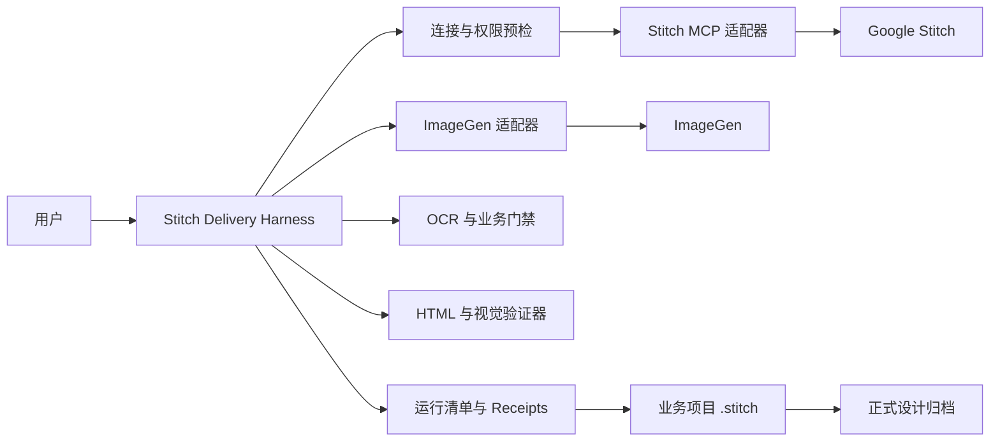
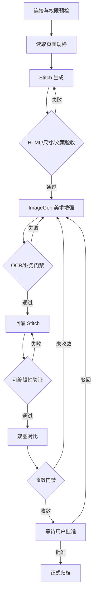
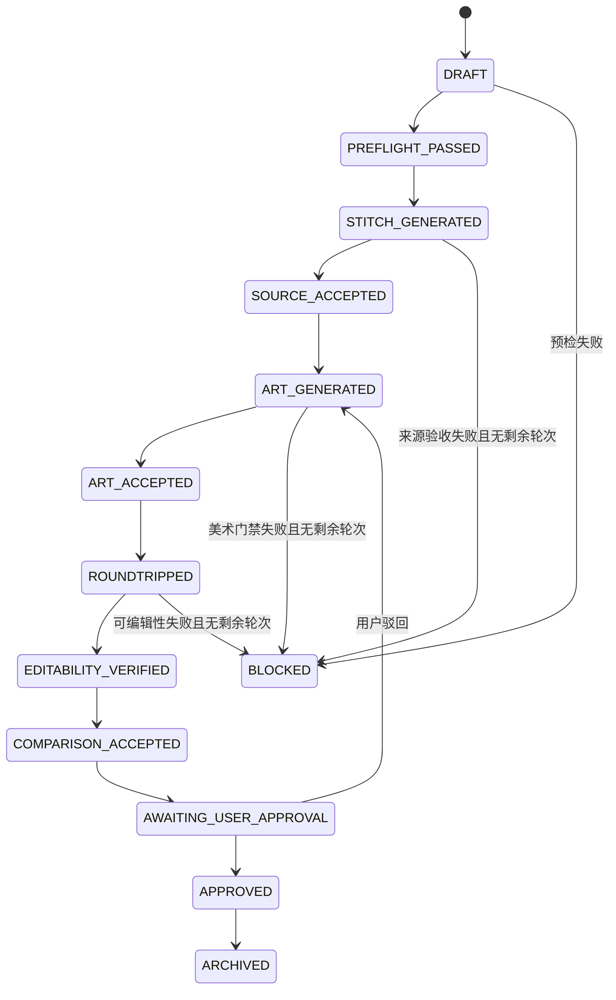

# Stitch 可编辑设计交付 Harness 设计

## 1. 目标与状态

本规格定义 Stitch Design 插件的可靠设计交付 Harness。它把一次性的“调用 Stitch 生图”提升为可恢复、可审计、可复用的设计生产线，并以 WeKefu Desktop 登录页闭环作为首个验收样板。

本设计已于 2026-09-13 获得用户对以下边界的确认：通用 Harness 属于 `stitch-design-plugin`；业务项目只保存页面规格、运行证据、候选产物和批准产物。

成功标准：同一页面必须同时交付经验证的可编辑 HTML 和经用户批准的美工稿；任何远程调用成功、截图存在、OCR 通过或像素分数达标，都不能单独代表正式完成。

## 2. 范围

### 2.1 本期范围

- 安全连接 Google Stitch MCP，不在配置、命令行、日志或归档中暴露 API Key。
- 检测并阻止多个 Stitch Design 插件实例同时提供相同能力。
- 执行页面规格到 Stitch、ImageGen、回灌、双图对比、用户批准和正式归档的有限状态机。
- 对 HTML、画布尺寸、固定文案、OCR、业务规则、可编辑性和视觉一致性执行独立门禁。
- 每一步产生结构化 receipt，支持中断恢复、未知写入对账和失败定位。
- 以 WeKefu Desktop 登录页既有 1350×768 闭环产物完成真实样板验收。

### 2.2 非目标

- 不替代 Google Stitch、ImageGen 或 OCR 服务。
- 不自动批准设计，不以模型自评替代用户批准。
- 不把 Stitch 项目数据托管到插件作者的服务。
- 不在本期构建通用项目管理、多人审批或云端任务队列。
- 不要求所有业务项目采用 WeKefu 的设计语言、尺寸或目录结构。
- 不把生成式图片当作最终可编辑页面代码。

## 3. 采用的架构

采用“插件级 Harness + 项目级契约 + 供应商适配器”。没有采用 WeKefu 仓库内的一次性脚本，因为它无法复用于其他产品；也没有建设独立云服务，因为本期无需引入账号系统、数据库和额外信任边界。



### 3.1 责任边界

| 组件 | 负责 | 不负责 |
|---|---|---|
| Harness 编排器 | 状态迁移、步骤授权、恢复、证据聚合 | 生成页面和图片的供应商能力 |
| Stitch MCP 适配器 | 安全认证、MCP 会话、请求与响应归一化 | 判断页面业务正确性 |
| ImageGen 适配器 | 带来源图和约束执行美术增强 | 修改业务事实或批准结果 |
| 验收器 | 尺寸、文案、DOM、OCR、业务规则、视觉差异 | 自动代替用户批准 |
| 项目契约 | 页面规格、阈值、业务规则、归档位置 | 实现通用编排逻辑 |
| Receipt 存储 | 记录输入输出哈希、状态、时间与错误 | 保存凭据或完整供应商响应日志 |

## 4. 端到端流程



每次循环只处理一个页面和一个已授权迭代。默认最多三轮美术增强与回灌；达到上限仍未收敛时进入 `BLOCKED`，保留全部证据并等待用户决定，不能自行扩展轮次。

## 5. 页面规格契约

业务项目在 `.stitch/specs/<page-id>.json` 保存页面规格。`page-id` 只能包含小写字母、数字和连字符，不得包含路径分隔符或 `..`。

```json
{
  "schema_version": 1,
  "page_id": "login",
  "title": "WeKefu Desktop 登录",
  "canvas": {"width": 1350, "height": 768, "scale": 1},
  "theme": "light",
  "fixed_copy": [
    "WeKefu Desktop",
    "统一接待多个客户渠道",
    "智能体协同与人工审核",
    "本地设备与 RPA 安全执行"
  ],
  "editable_regions": ["headline", "account-form", "feature-strip"],
  "forbidden_patterns": ["真实手机号", "真实订单号", "API Key"],
  "business_assertions": [
    {
      "id": "promo-unboxed",
      "type": "dom-style",
      "selector": "[data-purpose='feature-strip'] > *",
      "count": 3,
      "forbidden_properties": ["background-image", "box-shadow", "border-radius"]
    }
  ],
  "comparison": {
    "critical_copy_recall": 1.0,
    "layout_score_min": 0.95,
    "visual_quality_score_min": 4
  },
  "archive": "docs/design-v1/desktop/login"
}
```

`fixed_copy` 必须逐字保留；允许模型润色的内容必须明确放在其他字段中。`business_assertions` 必须使用 Harness 已注册的类型和结构化参数，不能只写无法自动判定的自然语言。页面尺寸取自规格，不从浏览器截图外框、设备像素比或模型输出推断。WeKefu 首个样板固定为 1350×768、1×，不得自动扩展成 Web 宽屏。

## 6. 运行模型与状态机

每次执行创建 `.stitch/runs/<run-id>/manifest.json`。`run-id` 使用 UTC 时间和页面 ID，例如 `20260913T153000Z-login`。同一运行目录不可复用；恢复必须读取原 manifest。



任何状态迁移必须同时满足：前置状态正确、对应门禁通过、receipt 已原子写入、输出文件哈希与 receipt 相符。不能通过手工创建文件或修改状态字段跳过门禁。

## 7. Receipt 契约

每个步骤写入 `.stitch/runs/<run-id>/receipts/<sequence>-<step>.json`，至少包含：

- `schema_version`、`run_id`、`page_id`、`step`、`attempt`；
- 开始/结束 UTC 时间、结果 `passed|failed|unknown|blocked`；
- 输入文件相对路径和 SHA-256；
- 输出文件相对路径、SHA-256、MIME 和像素尺寸；
- 供应商资源 ID，但不保存签名下载地址、Cookie、Key 或完整请求 Header；
- 验收规则、实际值和失败原因；
- 上一步 receipt 的 SHA-256，形成不可断裂的证据链。

用户批准 receipt 还必须包含批准时的 Stitch HTML、美工稿、Stitch 渲染图和双图对比图哈希。批准后任何一个文件变化都会使批准失效并回到 `AWAITING_USER_APPROVAL`。

## 8. 安全连接与插件唯一性

### 8.1 本地 Stitch MCP 适配器

Codex 通过本地 stdio MCP 进程连接 Stitch。适配器从秘密提供器读取 Key，并仅在发往 `https://stitch.googleapis.com/mcp` 的同源 HTTPS 请求中添加 `X-Goog-Api-Key`。

秘密优先级：当前进程显式传入的 `STITCH_API_KEY` → 当前用户受限配置文件。默认路径不得访问 macOS Keychain、Windows Credential Manager 或 Linux Secret Service，避免后台代理触发交互式授权；这些系统存储仅供高级用户显式迁移。Unix 配置目录/文件权限为 `0700`/`0600`，Windows 继承当前用户 Profile ACL。配置不得进入仓库或 Codex 配置。

适配器必须支持 MCP 初始化、JSON 与 SSE 响应、通知、`Mcp-Session-Id`、协议版本传递和关闭。秘密每个代理进程读取一次并缓存；仅在 401/403 时重新读取一次并重试一次，其他写请求不得自动重试。所有错误输出经过秘密和签名 URL 脱敏。

### 8.2 唯一安装门禁

预检读取 Codex 插件清单和可用 Stitch 工具：

- 恰好一个启用的 `stitch-design` 插件且工具来源唯一时通过；
- 多个安装源、多个同名工具提供者或版本来源无法判定时进入 `BLOCKED`；
- Harness 只报告冲突项和修复建议，不自动卸载插件。

## 9. 验收门禁

### 9.1 Stitch 来源验收

- 下载并保存可编辑 HTML与渲染图。
- HTML 可解析，存在真实 DOM 元素、文本节点和样式；不能只是单张背景图或 Canvas 截图。
- 渲染内容区必须精确等于规格中的宽高，允许的误差为 0 像素。
- `fixed_copy` 召回率必须为 100%，禁用模式命中数必须为 0。
- 所有业务断言必须有确定的 `passed` 或 `failed` 结果，不接受仅由自然语言模型给出的“看起来正确”。

### 9.2 ImageGen 美术门禁

- 输入必须引用本轮通过的 Stitch 渲染图及其哈希。
- 输出尺寸必须与页面规格完全一致。
- OCR 对 `fixed_copy` 的召回率必须为 100%；无法识别的关键文本按失败处理。
- 禁止新增真实身份、联系方式、订单、密钥和未授权品牌资产。
- 业务断言逐项复核；美术增强不得更改信息架构和关键操作语义。

### 9.3 回灌与可编辑性门禁

- 回灌后重新下载 Stitch HTML和渲染图，不能只相信上传或编辑接口的成功文本。
- HTML 中规格列出的所有 `editable_regions` 均须映射到独立 DOM 子树。
- 通过一次无视觉影响的探针编辑验证可修改性；随后恢复原值并再次渲染，恢复稿哈希和关键文案必须一致。
- 如果 Stitch 只返回图片、扁平 Canvas 或不可定位的文本，可编辑性验收失败。

### 9.4 双图收敛门禁

比较对象为同尺寸的“回灌后 Stitch 渲染图”和“通过业务门禁的美工稿”。必须输出并排图、透明叠加图和差异热图。

- 关键文案召回率为 100%；
- 规格定义的布局评分不低于 0.95；
- 视觉评估器对层级、密度、色彩、组件质感和整体完成度分别按 1–5 分评分，每项不低于 4；
- 所有自动门禁通过后只进入 `AWAITING_USER_APPROVAL`，仍需用户明确批准。

## 10. 错误处理与恢复

| 场景 | 行为 |
|---|---|
| Stitch 写入明确失败 | 记录失败，可在剩余轮次内修正输入后重试 |
| Stitch 写入超时或响应丢失 | 标记 `unknown`，用项目/屏幕只读查询对账，禁止直接重发 |
| ImageGen 失败 | 保留来源稿和失败 receipt，不进入 OCR |
| OCR 或业务门禁失败 | 回到本轮 ImageGen 修正，不回灌 Stitch |
| 回灌结果不可编辑 | 保留失败 HTML和截图，回到回灌步骤或在轮次耗尽后阻塞 |
| 文件哈希变化 | 使下游 receipt 和用户批准失效 |
| 进程中断 | 从最后一个完整且哈希有效的 receipt 恢复 |
| 凭据撤销 | 当前远程步骤停止；已归档的本地产物保持只读可审阅 |

所有文件写入先写同目录临时文件，再原子替换。恢复时先校验 manifest、receipt 链和产物哈希；发现断链时进入 `BLOCKED`，不得猜测状态。

## 11. 正式归档

只有 `APPROVED` 运行可以归档。归档目录至少包含：

- 页面规格快照；
- 可编辑 Stitch HTML；
- Stitch 最终渲染图；
- ImageGen 最终美工稿；
- 并排图、叠加图和差异热图；
- 脱敏后的 receipt 链和批准记录；
- `README.md`，列出页面 ID、尺寸、主题、来源资源 ID和文件哈希。

如果归档需要移动已经在对话中引用的本地图片，原路径必须留下指向新文件的相对软连接，并验证软连接可读、目标哈希一致。归档不得覆盖同名已批准版本；新批准结果使用新的版本目录。

## 12. 命令与接口

Harness 对外提供一个稳定入口，具体实现可以拆分模块，但命令语义固定：

```text
stitch_harness.py preflight --project <path>
stitch_harness.py start --project <path> --spec <page-id>
stitch_harness.py resume --project <path> --run <run-id>
stitch_harness.py status --project <path> --run <run-id>
stitch_harness.py approve --project <path> --run <run-id>
stitch_harness.py archive --project <path> --run <run-id>
```

`approve` 只能在交互式用户批准后执行；智能体不能根据自动评分自行调用。所有命令成功返回 0，门禁未通过返回 1，参数或契约错误返回 2，状态未知返回 3。

## 13. 测试与验收

### 13.1 离线自动化

- 秘密提供器、脱敏器和旧凭据迁移测试；测试 Key 不得出现在 stdout、stderr、进程参数、receipt 或配置快照。
- stdio MCP 到模拟 HTTP MCP 的初始化、会话、JSON、SSE、通知和错误映射测试。
- 401/403 只刷新一次；未知写入不盲重试。
- 页面规格 Schema、路径逃逸、状态迁移、原子写入、receipt 链和哈希失效测试。
- HTML 尺寸、DOM、固定文案、禁用模式和可编辑区域测试。
- OCR、业务断言、双图产物和评分阈值测试。
- 归档防覆盖、批准失效和移动后软连接测试。
- 重复插件与重复工具来源预检测试。

### 13.2 真实集成验收

1. 使用用户已轮换的 Key 完成只读 `list_projects`。
2. 在一个专用测试项目完成一次 Stitch 生成并下载 HTML和渲染图。
3. 执行 WeKefu 登录页 1350×768 全闭环。
4. 验证三条左侧宣传语不使用独立卡片容器，固定文案和尺寸全部通过。
5. 在回灌后的 Stitch 页面执行探针编辑和恢复，证明 HTML 仍可编辑。
6. 输出三种双图对比产物，进入等待用户批准状态。
7. 用户批准后归档，并验证旧对话图片路径的软连接仍可读取。

离线测试、真实 Stitch 调用、ImageGen 结果、可编辑性验证、用户批准和正式归档是六个独立证据层，必须分别报告。

## 14. 兼容与迁移

- 保留现有 40 个 Stitch Skills 的用户入口；Harness 作为高可信交付入口，不破坏单次查询和轻量编辑能力。
- `stitch-loop` 后续改为调用 Harness 状态机，不再自行定义另一套完成语义。
- 首次设置向导默认使用当前用户受限配置，并把系统秘密存储保留为显式高级迁移选项。
- 现有 `.stitch/loops/` 产物保持只读；可通过导入命令生成 receipt，但不得伪造历史用户批准。
- 插件升级不自动删除用户数据、远程 Stitch 项目或已有设计稿。

## 15. 完成定义

本改造只有同时满足以下条件才可称为完成：

1. 安全 stdio Stitch 连接在当前 macOS Codex Desktop 实测通过，Key 未进入任何可见输出。
2. 重复插件门禁测试通过，当前机器只有一个启用的 Stitch Design 来源。
3. Harness 离线测试、分发校验和秘密扫描通过。
4. WeKefu 登录页从规格到正式归档完成一次真实闭环。
5. 可编辑 HTML、美工稿、三种对比图、receipt 链和用户批准记录齐全。
6. README、架构文档、技术方案和相关 Skills 与本规格一致。
7. 未经用户授权不执行推送、发布、Marketplace 升级或删除旧凭据。
