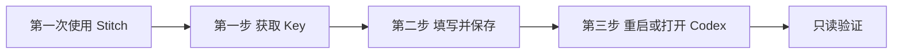

# Stitch Design 首次使用向导设计

## 目标

当本地 Codex 第一次使用 Stitch Design 且缺少 `STITCH_API_KEY` 时，自动打开一个简单的本地设置页面。普通用户只完成三步，不需要理解 MCP、环境变量或插件安装目录。

## 用户流程

### 第一步：获取 Key

- 显示一句说明：“前往 Stitch 设置创建 API Key。”
- 主按钮“打开 Stitch 设置”，打开 `https://stitch.withgoogle.com/settings`。
- 提示：“请勿把 Key 发送到聊天。”

### 第二步：填写并保存

- 一个密码输入框，默认隐藏内容。
- 可选的显示/隐藏按钮。
- 主按钮“保存到本机”。
- 成功后立即清空输入框。
- 失败时只显示可行动原因，不显示 Key、请求体或内部异常堆栈。

### 第三步：完成

- 显示“配置成功，请重新打开 Codex”。
- 提供“打开 Codex”按钮；无法自动打开时提供一条当前平台可复制的启动命令。
- 下一次任务先执行只读 `list_projects`；返回项目或空列表都视为验证成功。

## 页面布局

页面参考即梦安装页中间区域的组织方式，但不复制其品牌或资产：

- 浅色柔和背景；
- 页面中央单张白色卡片；
- 顶部为 Stitch Design 标识、标题和一句副标题；
- 卡片内纵向排列三步；
- 当前步骤突出显示，已完成步骤显示完成状态；
- 高级用户命令收纳在底部“高级设置”折叠区。

响应式验收尺寸：

- Mobile：390×884
- Tablet：768×1024
- Desktop：1280×1024

## 普通模式与高级模式

普通模式不显示 MCP URL、端口、配置目录、文件权限或环境变量命令。

高级设置折叠区仅包含：

- macOS/Linux 临时环境变量命令；
- Windows PowerShell 临时环境变量命令；
- 本机配置文件位置；
- Key 替换和清除说明。

## 本地实现边界

- 使用现有 Python 配置器启动本地页面并保存凭据。
- 页面只在本机使用，不部署公网服务。
- 凭据只写入当前用户配置，不写入插件目录、Git、聊天或日志。
- 保存后由向导启动新 Codex 进程；不尝试修改已经运行进程的环境。
- ChatGPT 网页版不使用该向导，继续等待正式 Stitch connector/OAuth。

## 安全约束

- 页面不得向第三方发送 Key。
- 不使用外部 JavaScript、字体、图片或分析服务。
- 不在 URL、浏览器存储、页面源码或错误信息中保存 Key。
- 保存接口只接受本地页面发起的一次性请求。
- 页面响应禁止缓存。
- 不能证明保存成功时，不显示“配置成功”。

## 验收标准

1. 缺少凭据时能够打开首次设置页面。
2. 用户可从页面打开 Stitch Settings。
3. Key 输入默认隐藏，保存后被清空。
4. 保存结果进入当前用户配置，不修改 shell profile 或系统全局环境。
5. 页面不回显或记录 Key。
6. 完成页能启动 Codex，或给出一条可复制的当前平台命令。
7. 高级设置默认折叠。
8. 三个目标尺寸下无横向溢出，主要按钮和输入框可操作。
9. 自动化测试覆盖保存成功、空 Key、无效请求、敏感信息不回显和跨平台启动命令。

## 非目标

- 不建设公网认证网关。
- 不实现 Stitch OAuth。
- 不把作者 Key 或共享 Key打包进插件。
- 不修改系统级永久环境变量。
- 不为首次设置创建 Stitch 测试项目。
